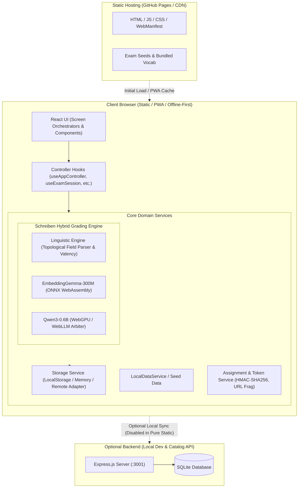
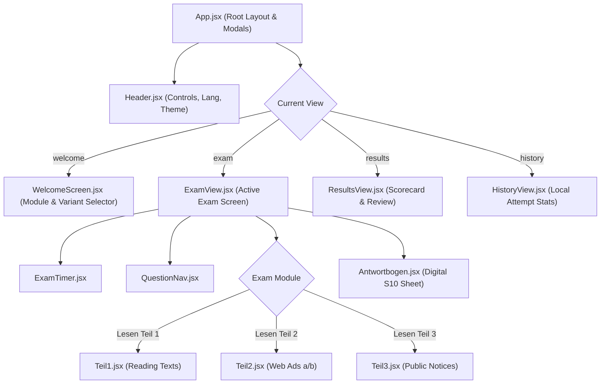
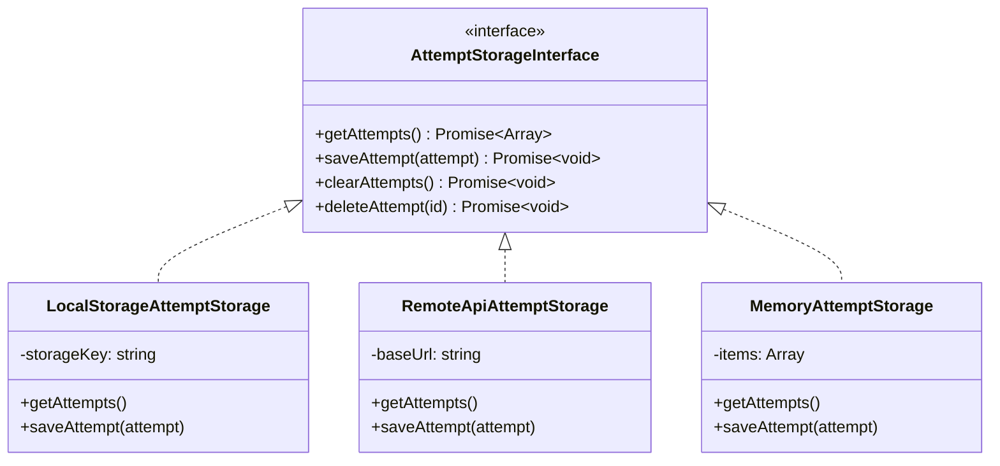
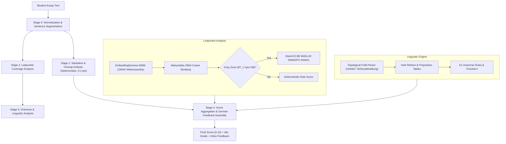
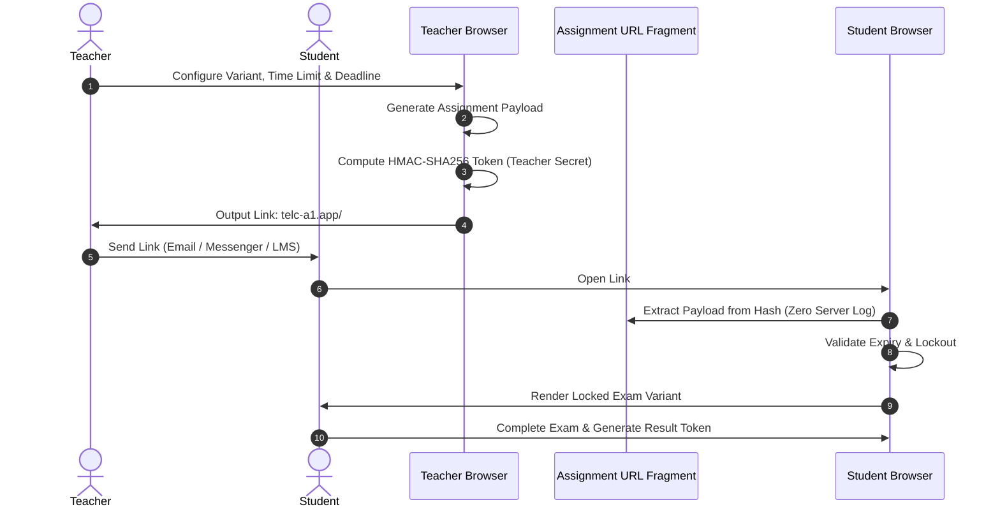

# System Architecture — telc Deutsch A1 Exam Simulator

This document provides a comprehensive overview of the architecture, subsystems, data flow, and design principles of the **telc Deutsch A1 Exam Simulator**.

---

## 1. Architectural Principles & Product Philosophy

The application is engineered around four non-negotiable principles:

1. **Browser-First & Serverless**: The entire core application—including exam delivery, evaluation, scoring, error analysis, history, and AI/WebGPU computation—runs completely in the client browser. It deploys as a static bundle to GitHub Pages.
2. **Offline-First & PWA**: After static assets and AI model weights are cached, the application functions with zero internet connectivity. Service Workers cache application shell assets, and models are stored in browser CacheStorage/IndexedDB.
3. **Zero-Knowledge Privacy**: Student exam attempts, typed essays, test history, and teacher assignment links are stored locally (`localStorage`) or encoded in the URL fragment (`#token=...`), ensuring no student private data leaks to a central server.
4. **Clean Architecture & McConnell Modularity**: Strict separation of concerns (SRP), Single Level of Abstraction (SLAP), small cohesive functions, and decoupled domain services wrapped behind clear interfaces.

---

## 2. High-Level System Architecture

---

## 3. Frontend Architecture

### 3.1 Screen Orchestration Pattern
The React presentation layer strictly follows the **Screen Orchestrator** pattern:
- Top-level screen components (`ExamView.jsx`, `WelcomeScreen.jsx`, `ResultsView.jsx`, `HistoryView.jsx`) contain minimal DOM and orchestrate modular subcomponents located in dedicated subdirectories (`components/welcome/`, `components/results/`, `components/exam/`, etc.).
- State and business logic are decoupled from rendering using custom React controller hooks:
  - `useAppController`: Global route/view coordinator, modal coordinator, and theme manager.
  - `useExamSession`: Active exam state, question answers, timer synchronization, and completion triggers.
  - `useExamLoader`: Dynamic loading and hydration of exam variants (Lesen, Schreiben, Stubs).
  - `useAssignmentMode`: Teacher-generated assignments, token parsing, and anti-tamper lockout validation.
  - `useSchreibenAiChecker`: Orchestrates the asynchronous multi-stage evaluation pipeline.

### 3.2 Component Hierarchy

### 3.3 Interface Contracts & Contract Guard
Core ports and adapters declare formal contract specifications in `src/contracts/` (`timerContract`, `sessionContract`, `loaderContract`, `assignmentContract`, and `screenContracts`). At build time, `scripts/verify-contracts.js` statically verifies method invocations and screen DTO completeness, aborting the build on any contract drift.

---

## 4. Storage & State Abstraction

The storage layer implements the **Strategy Pattern** via a unified `AttemptStorageInterface`:

- **LocalStorageAttemptStorage** (Default): Browser-local storage; requires no network, completely private.
- **RemoteApiAttemptStorage**: Connects to the optional local Express REST backend.
- **MemoryAttemptStorage**: Ephemeral storage used for isolated tests and headless verification.
- **AssignmentLockoutStorage**: Stores completion tokens for teacher assignments to prevent duplicate submissions.

---

## 5. Schreiben Hybrid Grading Architecture

The essay evaluator (*Schreiben Teil 2*) runs 100% in-browser using a multi-stage hybrid engine combining deterministic German linguistic models with local WebAssembly/WebGPU models.

### 5.1 Pipeline Flowchart

### 5.2 Linguistic Engine (No Fragile Regexes)
In compliance with project standards, natural language evaluation avoids ad-hoc regex patching:
- **Topological Field Parser**: Identifies sentence structure (*Vorfeld*, *Linke Satzklammer* (finite verb in position 2), *Mittelfeld*, *Rechte Satzklammer* (participle/infinitive), and *Nachfeld*).
- **Valency & Case Model**: Analyzes verb government (e.g., *helfen* + Dativ, *warten* + auf + Akkusativ).
- **Orthography & Agreement**: Analyzes subject-verb agreement and noun capitalization.

### 5.3 Hardware Runtime Adaptation & Fallback Matrix

| Environment | Embeddings Engine | Arbiter Engine | Mode |
| :--- | :--- | :--- | :--- |
| Modern WebGPU (macOS, Windows, iOS 26+) | ONNX Runtime Web (Wasm) | Qwen3-0.6B via WebLLM | **Full Hybrid Mode** |
| WebGPU Unsupported / Older Browser | ONNX Runtime Web (Wasm) | Keyword & Pattern Heuristic | **Embedding + Heuristic Mode** |
| Low Memory / Wasm Only | Deterministic Keyword Matcher | Deterministic Baseline | **Limited Deterministic Mode** |

Runtime capability is determined strictly via runtime detection (`navigator.gpu` + `requestAdapter()`), avoiding brittle user-agent sniffing.

### 5.4 Canonical Prompt Architecture & Arbitration Contracts
To ensure strict adherence to Single Responsibility Principle (SRP) and prevent contract divergence across providers:
- **Single Source of Truth (`src/services/schreiben/grading/prompts.js`)**: All prompt templates for Leitpunkt arbitration, grammar suggestions, and feedback verbalization are consolidated in a unified module.
- **Balanced Gray-Zone Arbitration**: The Leitpunkt prompt enforces balanced few-shots (1 full, 1 partial, 1 no) to eliminate frequency bias towards `full`.
- **Semantic Similarity Calibration**: EmbeddingGemma task prefixes are calibrated to `task: sentence similarity | query:` and `task: sentence similarity | text:` according to the official model specification.
- **Fail-Safe Fallbacks**: Malformed or damaged LLM outputs fall back to `null` to ensure deterministic baseline scores are preserved without artificial score inflation.

---

## 6. Teacher Workspace & Assignment Security

The platform includes a dedicated **Teacher Workspace** that operates without server dependencies:

- **Zero-Knowledge Distribution**: Assignment configuration is packed into the URL hash fragment (`#assignment=...` or `#task=...`). URL fragments are never transmitted to web servers in HTTP request headers.
- **Tamper Prevention**: Configurations are signed using client-generated HMAC-SHA256 signatures.
- **Inspection Mode**: Dedicated variant inspection allowing teachers to preview exams without polluting student attempt history.
- **Assignment Continuity**: Domain service `assignmentTimerService` computes remaining session duration across page reloads based on cryptographic timestamps, preventing infinite retries while preserving student progress.
- **Immediate Submission & Teacher Link Flow**: Upon completing an assignment, `useExamFlowActions` finalizes the attempt via `assignmentMode.finalizeAssignment`, generating a signed `#review=...` URL and recording lockout state. `buildResultsProps` passes `assignmentSubmission` to `ResultsView`, which immediately presents `AssignmentSubmissionBanner` with a one-click copy button for the teacher link, while preventing unauthorized retakes in `ResultsActionBar`.

---

## 7. Optional Server & SQLite Architecture

For local development or environments requiring a centralized exam catalog:
- **Express.js API (`server/index.js`)**: Provides REST endpoints for exam definitions, test types, and optional attempt sync.
- **Database Facade (`server/db.js`)**: Manages SQLite connection lifecycle, applying idempotent schema migrations (`database/migrations.js`) and executing seed validation (`database/seeder.js`).
- **Seed Aggregator (`server/seed-data.js`)**: A barrel aggregator importing modular exam variants from `server/seeds/`.

---

## 8. Verification & Quality Gates

1. **Contract-Guarded Build (`prebuild`)**: `npm run build` runs `npm run verify:contracts` and `npm test` before compilation. Any contract violation or test failure aborts the build with Exit code 1.
2. **Automated Unit & Contract Tests**: `npm test` runs Node.js native test suites covering routing, linguistic rules, scoring logic, button action contracts (`tests/assignment-buttons.test.js`, `tests/exam-buttons.test.js`, `tests/assignment-results-flow.test.js`), and assignment security.
3. **Seed Schema Validation**: `npm run validate:seeds` verifies the structural integrity of all exam variants, questions, answer keys, and vocabulary explanations.
4. **Schreiben Evaluation Benchmarks**: `npm run eval:schreiben` validates AI and linguistic engine grading against gold-standard A1 essays.
5. **Headless Chrome CDP E2E Testing**:
   - `npm run test:e2e` (`tests/e2e/all-buttons-smoke.js`): verifies real browser button interactions, DOM transitions, and zero `Runtime.exceptionThrown` console errors.
   - `npm run test:e2e:assignment` (`tests/e2e/assignment-flow-e2e.js`): verifies full student homework lifecycle from `#task=...` link to exam submission, immediate `AssignmentSubmissionBanner` rendering, crash-free question review card expansion ("Разбор"), and `#review=...` verification screen.
