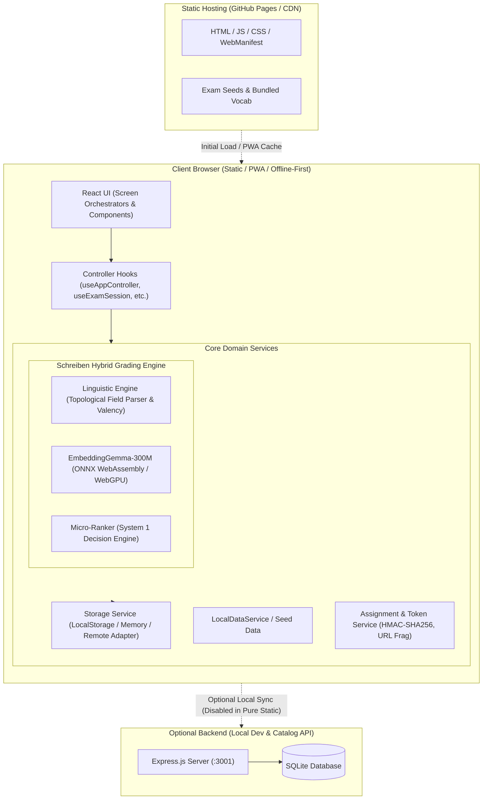
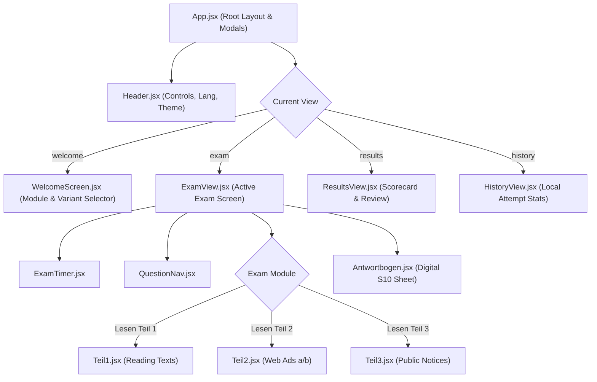
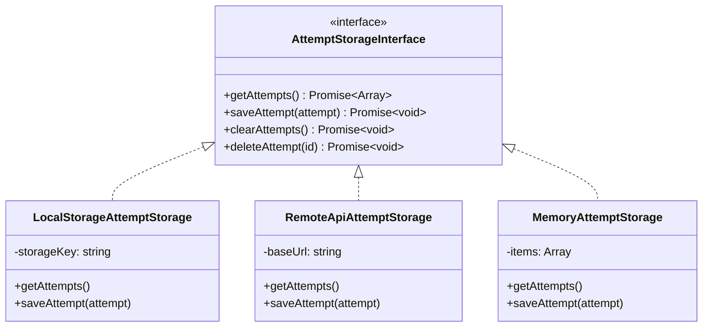
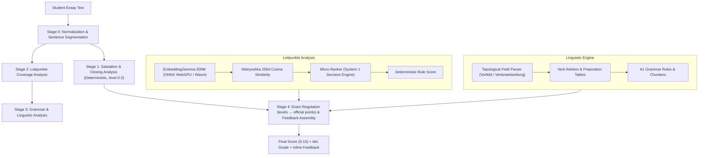
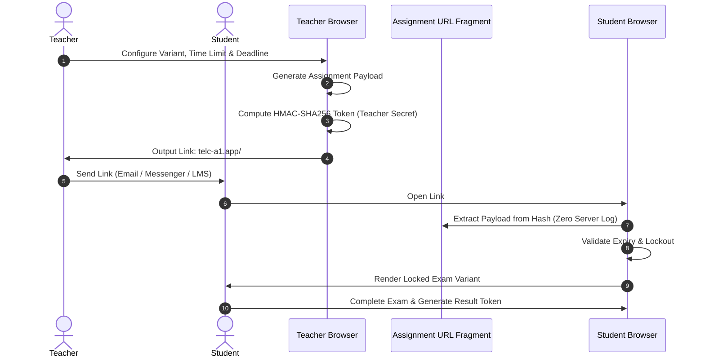

# System Architecture — telc Deutsch A1 Exam Simulator

This document provides a comprehensive overview of the architecture, subsystems, data flow, and design principles of the **telc Deutsch A1 Exam Simulator**.

---

## 1. Architectural Principles & Product Philosophy

The application is engineered around four non-negotiable principles:

1. **Browser-First & Serverless**: The entire core application—including exam delivery, evaluation, scoring, error analysis, history, and AI/WebGPU computation—runs completely in the client browser. It deploys as a static bundle to GitHub Pages.
2. **Offline-First & PWA**: After static assets and AI model weights are cached, the application functions with zero internet connectivity. Service Workers cache application shell assets, and models are stored in browser CacheStorage/IndexedDB.
3. **Zero-Knowledge Privacy**: Student exam attempts, typed essays, test history, and teacher assignment links are stored locally (`localStorage`) or encoded in the URL fragment (`#token=...`), ensuring no student private data leaks to a central server.
4. **Clean Architecture & McConnell Modularity**: Strict separation of concerns (SRP), Single Level of Abstraction (SLAP), small cohesive functions, and decoupled domain services wrapped behind clear interfaces.

---

## 2. High-Level System Architecture

```mermaid
flowchart TB
    subgraph Client["Client Browser (Static / PWA / Offline-First)"]
        direction TB
        UI["React UI (Screen Orchestrators & Components)"]
        Hooks["Controller Hooks (useAppController, useExamSession, etc.)"]
        
        subgraph Services["Core Domain Services"]
            ExamSvc["LocalDataService / Seed Data"]
            StorageSvc["Storage Service (LocalStorage / Memory / Remote Adapter)"]
            SecuritySvc["Assignment & Token Service (HMAC-SHA256, URL Frag)"]
            
            subgraph SchreibenEngine["Schreiben Hybrid Grading Engine"]
                NLP["Linguistic Engine (Topological Field Parser & Valency)"]
                Embeddings["EmbeddingGemma-300M (ONNX WebAssembly / WebGPU)"]
                MicroRanker["Micro-Ranker (System 1 Decision Engine)"]
            end
        end
        
        UI --> Hooks
        Hooks --> Services
        Services --> StorageSvc
    end

    subgraph StaticHost["Static Hosting (GitHub Pages / CDN)"]
        StaticAssets["HTML / JS / CSS / WebManifest"]
        PrecachedSeeds["Exam Seeds & Bundled Vocab"]
    end

    subgraph OptionalBackend["Optional Backend (Local Dev & Catalog API)"]
        Express["Express.js Server (:3001)"]
        SQLite[(SQLite Database)]
        Express --> SQLite
    end

    StaticHost -.->|"Initial Load / PWA Cache"| Client
    Client -.->|"Optional Local Sync (Disabled in Pure Static)"| OptionalBackend
```

---

## 3. Frontend Architecture

### 3.1 Screen Orchestration Pattern
The React presentation layer strictly follows the **Screen Orchestrator** pattern:
- Top-level screen components (`ExamView.jsx`, `WelcomeScreen.jsx`, `ResultsView.jsx`, `HistoryView.jsx`) contain minimal DOM and orchestrate modular subcomponents located in dedicated subdirectories (`components/welcome/`, `components/results/`, `components/exam/`, etc.).
- State and business logic are decoupled from rendering using custom React controller hooks:
  - `useAppController`: Global route/view coordinator, modal coordinator, and theme manager.
  - `useExamSession`: Active exam state, question answers, timer synchronization, and completion triggers.
  - `useExamLoader`: Dynamic loading and hydration of exam variants (Lesen, Schreiben, Stubs).
  - `useAssignmentMode`: Teacher-generated assignments, token parsing, and anti-tamper lockout validation.
  - `useSchreibenAiChecker`: Orchestrates the asynchronous multi-stage evaluation pipeline.

### 3.2 Component Hierarchy

```mermaid
graph TD
    App["App.jsx (Root Layout & Modals)"]
    App --> Header["Header.jsx (Controls, Lang, Theme)"]
    App --> ViewSelector{Current View}
    
    ViewSelector -->|welcome| WelcomeScreen["WelcomeScreen.jsx (Module & Variant Selector)"]
    ViewSelector -->|exam| ExamView["ExamView.jsx (Active Exam Screen)"]
    ViewSelector -->|results| ResultsView["ResultsView.jsx (Scorecard & Review)"]
    ViewSelector -->|history| HistoryView["HistoryView.jsx (Local Attempt Stats)"]
    
    ExamView --> ExamTimer["ExamTimer.jsx"]
    ExamView --> QuestionNav["QuestionNav.jsx"]
    ExamView --> ActiveModule{Exam Module}
    
    ActiveModule -->|Lesen Teil 1| Teil1["Teil1.jsx (Reading Texts)"]
    ActiveModule -->|Lesen Teil 2| Teil2["Teil2.jsx (Web Ads a/b)"]
    ActiveModule -->|Lesen Teil 3| Teil3["Teil3.jsx (Public Notices)"]
    ExamView --> Antwortbogen["Antwortbogen.jsx (Digital S10 Sheet)"]
```

### 3.3 Interface Contracts & Contract Guard
Core ports and adapters declare formal contract specifications in `src/contracts/` (`timerContract`, `sessionContract`, `loaderContract`, `assignmentContract`, and `screenContracts`). At build time, `scripts/verify-contracts.js` statically verifies method invocations and screen DTO completeness, aborting the build on any contract drift.

### 3.4 Theme Initialization & Zero-FOUC Architecture
To eliminate white canvas flashing (FOUC / FART) upon desktop browser reload:
- `<meta name="color-scheme" content="dark light" />` placed in `<head>` immediately initializes the Chromium/WebKit document canvas to dark mode.
- Synchronous render-blocking script `public/theme-init.js` (``) resolves `localStorage` and `prefers-color-scheme` before the initial layout paint, toggling `.dark`/`.light` and setting `root.style.colorScheme`.
- Static and CSP-compliant (`script-src 'self'`), without asynchronous module bundling delays.

---

## 4. Storage & State Abstraction

The storage layer implements the **Strategy Pattern** via a unified `AttemptStorageInterface`:

```mermaid
classDiagram
    class AttemptStorageInterface {
        <<interface>>
        +getAttempts() Promise~Array~
        +saveAttempt(attempt) Promise~void~
        +clearAttempts() Promise~void~
        +deleteAttempt(id) Promise~void~
    }
    class LocalStorageAttemptStorage {
        -storageKey: string
        +getAttempts()
        +saveAttempt(attempt)
    }
    class RemoteApiAttemptStorage {
        -baseUrl: string
        +getAttempts()
        +saveAttempt(attempt)
    }
    class MemoryAttemptStorage {
        -items: Array
        +getAttempts()
        +saveAttempt(attempt)
    }
    
    AttemptStorageInterface <|.. LocalStorageAttemptStorage
    AttemptStorageInterface <|.. RemoteApiAttemptStorage
    AttemptStorageInterface <|.. MemoryAttemptStorage
```

- **LocalStorageAttemptStorage** (Default): Browser-local storage; requires no network, completely private.
- **RemoteApiAttemptStorage**: Connects to the optional local Express REST backend.
- **MemoryAttemptStorage**: Ephemeral storage used for isolated tests and headless verification.
- **AssignmentLockoutStorage**: Stores completion tokens for teacher assignments to prevent duplicate submissions.

---

## 5. Schreiben Hybrid Grading Architecture

The essay evaluator (*Schreiben Teil 2*) runs 100% in-browser using a multi-stage hybrid engine combining deterministic German linguistic models with local WebAssembly/WebGPU models.

### 5.1 Pipeline Flowchart

```mermaid
flowchart TD
    Input["Student Essay Text"] --> S0["Stage 0: Normalization & Sentence Segmentation"]
    S0 --> S1["Stage 1: Salutation & Closing Analysis (Deterministic, level 0-2)"]
    
    S0 --> S2["Stage 2: Leitpunkte Coverage Analysis"]
    subgraph S2_Details["Leitpunkte Analysis"]
        Embed["EmbeddingGemma-300M (ONNX WebGPU / Wasm)"]
        Cos["Matryoshka 256d Cosine Similarity"]
        Ranker["Micro-Ranker (System 1 Decision Engine)"]
        Embed --> Cos --> Ranker
        Ranker --> CodeScore["Deterministic Rule Score"]
    end
    
    S2 --> S3["Stage 3: Grammar & Linguistic Analysis"]
    subgraph S3_Details["Linguistic Engine"]
        Topo["Topological Field Parser (Vorfeld / Verbzweitstellung)"]
        Valency["Verb Rektion & Preposition Tables"]
        Grammar["A1 Grammar Rules & Chunkers"]
        Topo --> Valency --> Grammar
    end
    
    S1 & S2_Details & S3_Details --> S4["Stage 4: Exam Regulation (levels → official points) & Feedback Assembly"]
    S4 --> Output["Final Score (0-15) + telc Grade + Inline Feedback"]
```

### 5.2 Linguistic Engine (No Fragile Regexes)
In compliance with project standards, natural language evaluation avoids ad-hoc regex patching:
- **Topological Field Parser & Proposition Deconstructor (`topologicalFieldParser.js`, `clauseStructureParser.js`)**: Identifies sentence fields (*Vorfeld*, *Linke Satzklammer* (finite verb in position 2), *Mittelfeld*, *Rechte Satzklammer* (participle/infinitive), and *Nachfeld*), tracks coordinated subordinate clause scopes, and extracts predicate cores, arguments, and temporal markers.
- **Semantic Intent Matcher & Polarity Validator (`semanticIntentMatcher.js`, `semanticPolarityValidator.js`)**: Evaluates structural polarity (*Satznegation* with `nicht` in pre-verbal Mittelfeld, *Nominalnegation* with `kein*`, and defect vs positive states). Compares clause structures against Leitpunkt intent contracts (`DEFECT_REPORT`, `ACTION_REQUEST`, `APPOINTMENT_CANCEL`, `APPOINTMENT_PROPOSAL`), deterministically preventing LLM sycophancy, semantic inversion, and cross-criterion token leakage.
- **Criterion-anchored refusals (`criterionRequestTargets.js`, v0.7.16)**: an `ACTION_REQUEST` refusal (`negated_entity` / `negated_action`) fires only when the negated noun or verb matches the criterion's own rubric `keywords` (stemmed; separable verbs also match by their base verb, e.g. `kommen Sie … vorbei` → `kommen`). The code holds no domain word lists: what a Leitpunkt is about lives in rubric data, and a criterion without keywords never produces a refusal. So "ich kann nicht zum Kurs kommen" cannot refuse a "Hausaufgaben" point.
- **Polarity gate (`grading/criterionPolarityGate.js`, v0.7.16)**: the single frame/inversion check for Leitpunkt evidence, shared by `pipelineStageScorers.js` and `stage2Leitpunkte.js`. Vector matching (cosine ≥ 0.35) can pull unrelated sentences into a criterion's evidence, so a refusal zeroes the point **only when no affirmative keyword evidence exists** for that criterion. Frame (conversive-rule) penalties are unchanged.
- **Refusal detector for every intent (`criterionRefusalDetector.js`, v0.7.18)**: the criterion-anchored refusal now applies to every Leitpunkt intent, not only `ACTION_REQUEST`. Three structural rules against the rubric targets: `negated_entity` (target noun under `kein`), `negated_action` (clause with `nicht` whose predicate is a target) and `negated_participant` (clause with `nicht` whose subject is a target, e.g. "Meine Schwester kommt nicht" for "Begleitperson"). Complements under `nicht` are deliberately ignored ("nicht am Montag" contrasts, it does not refuse). Which negations *express* a speech act instead of refusing it is declared once in `INTENT_POLARITY` (`semanticIntentMatcher.js`): cancellations and reasons are carried by any negation, a defect report only by a negated function ("funktioniert nicht"), never by a negated problem ("kein Problem"). Only `ACTION_REQUEST` refusals map to `LP_INVERTED_REQUEST`; all others map to `LP_INVERTED_GENERAL`.
- **Dual Scale Architecture (v0.7.24)**:
  - **Official telc A1 Grade (0–10)**: Governed strictly by `telcA1Regulation` based on CEFR A1 communicative achievement (3 Leitpunkte × 3 pts + Framing 1 pt). Grammar and syntax errors do not lower the official score unless the message is obstructed.
  - **Linguistic Accuracy (0–10 / %, `linguisticAccuracyScorer.js`)**: pedagogical defect density, independent of the official score. v0.7.25: one defect flagged by two analyzers counts once (`linguistic/grammarErrorDeduper.js`, applied in the shared `mergeCandidateGrammarErrors`, so the listed errors, the examiner feedback and the badge agree in every grading path), the density uses the letter body (`scoring/letterBodyWordCounter.js`, same count in pipeline and UI), defects are weighted by category (syntax 1.5, case/agreement 1.0, spelling 0.5), and the penalty is normalised per 30 words of the letter body (short texts are not scaled up). The scorer returns a band key; labels live in i18n (`results.linguisticAccuracy`). The UI badge is computed from the same error list it shows.
- **Explicit Compound Criterion Aspects (`aspects: [...]`, v0.7.24)**: Multi-faceted Leitpunkte (e.g. "Personen und Zeitraum", "Preis und Haustiere") explicitly define sub-aspects in rubric seeds. This prevents keyword loss during decomposition and enables precise sub-aspect query formation in Micro-Ranker.
- **Temporal expression detection (`temporalRangeDetector.js`, v0.7.25; replaces the v0.7.24 `TEMPORAL_RANGE_REGEX`)**: token-based. A range needs calendar boundaries (day number, `DD.MM.`, month, ordinal word) around `bis` / `-` / `bis zum`, so `vom 15.07. bis 25.07.` is a period and `von Hamburg bis Kiel` or `4 bis 5 Personen` is not. The `zeit` concept domain holds months, weekdays and seasons, but no function words (`vom`, `bis`, `ab`).
- **Valency & Case Model**: Analyzes verb government (e.g., *helfen* + Dativ, *warten* + auf + Akkusativ).
- **Orthography & Agreement**: Analyzes subject-verb agreement and noun capitalization.

### 5.3 Hardware Runtime Adaptation & Fallback Matrix

| Environment | Embeddings Engine | Decision Engine | Mode |
| :--- | :--- | :--- | :--- |
| Modern WebGPU / Wasm (Production Default) | Transformers.js (WebGPU/Wasm) | Micro-Ranker (EmbeddingGemma 300M q4) | **Micro-Ranker Decision Mode (Active)** |
| WebGPU Unsupported / Older Browser | Transformers.js (Wasm Fallback) | Micro-Ranker (EmbeddingGemma Wasm) | **Micro-Ranker (Wasm Fallback)** |
| Low Memory / Deterministic Only | Deterministic Keyword Matcher | Deterministic Baseline | **Limited Deterministic Mode** |

Runtime capability is determined strictly via runtime detection (`navigator.gpu` + `requestAdapter()`), avoiding brittle user-agent sniffing.

### 5.4 Canonical Prompt Architecture & Arbitration Contracts
To ensure strict adherence to Single Responsibility Principle (SRP) and prevent contract divergence across providers:
- **Single Source of Truth (`src/services/schreiben/grading/prompts.js`)**: All prompt templates for Leitpunkt arbitration, grammar suggestions, and feedback verbalization are consolidated in a unified module.
- **Balanced Gray-Zone Arbitration**: The Leitpunkt prompt enforces balanced few-shots (1 full, 1 partial, 1 no) to eliminate frequency bias towards `full`.
- **Semantic Similarity Calibration**: EmbeddingGemma task prefixes are calibrated to `task: sentence similarity | query:` and `task: sentence similarity | text:` according to the official model specification.
- **Fail-Safe Fallbacks**: Malformed or damaged LLM outputs fall back to `null` to ensure deterministic baseline scores are preserved without artificial score inflation.

### 5.5 Dual-Track Feedback Architecture: telc Examiner Report & Localized Tutor Notes
To preserve official telc A1 authenticity while providing maximum pedagogical clarity to language learners:
- **Official Examiner Report (Prüfer-Feedback)**: Assembled in authentic A1 German (`stage4Feedback.js` / `feedbackVerbalizer.js`), reflecting official telc criteria terminology and fact-locked verbalization.
- **Diagnostic Code Contract (`feedbackContracts.js`)**: Linguistic evaluation emits immutable diagnostic codes (`LP_FULFILLED`, `LP_PARTIAL`, `LP_MISSING`, `LP_INVERTED_DEFECT`, `LP_INVERTED_REQUEST`, `LP_FRAME_VIOLATION`, `ANREDE_PERFECT`, `ANREDE_REGISTER_MISMATCH`, `ANREDE_DECLENSION_FLAW`, `ANREDE_PUNCTUATION_FLAW`, `GRUSS_PERFECT`, etc.) along with assigned sentences.
- **Pure Tutor Feedback Resolver (`tutorFeedbackResolver.js`)**: Formats 1 clear, compassionate sentence per criterion in the student's selected interface language (`ru`, `en`, `de`), quoting relevant phrases when errors or inversions occur without hallucination.
- **Interactive Criteria Checklist (`SchreibenCriteriaChecklist.jsx`)**: Renders inline tutor notes directly below each criterion score badge for instant self-assessment and review.
- **Structured Examiner Feedback (v0.7.17)**: `IRankerPolicy.buildExaminerFeedback(facts)` (called from `grading/pipelineFeedback.js`, independent of the active provider, so it also works in limited mode) returns a language-neutral descriptor `examiner_feedback = { version, summary: [{code, params}], bullets: [{category, status, code, params}] }`. `feedback/examinerFeedbackBuilder.js` picks the codes (overall verdict → content → framing → grammar, max 4 summary sentences); params hold only verbatim German fragments of the letter (`quote`, `correction`) and rubric labels. Grammar highlights (`grammarHighlightSelector.js`) are chosen by checker `code`/`category`, never by parsing explanation text. `examinerFeedbackRenderer.js` + `examinerPhraseBank.js` (RU/EN) render the text **at display time** in the current UI language, so switching language needs no re-grading and stored attempts stay renderable. `SchreibenExaminerFeedbackCard.jsx` shows the summary plus quoted bullets and falls back to the legacy German `feedback_summary`, which is unchanged.

### 5.6 Confidence Floor Guardrail & Macro-Segment Grounding
To prevent aggressive false-negative penalties by edge LLMs (e.g. Qwen 0.6B) while preserving strict resistance to adversarial gaming:
- **Macro-Segment Grounding & Satellite Continuation (`schreibenTextSegmenter.js`)**: Assigns user sentences to criteria based on discourse cohesion. Unassigned elaboration clauses (satellites, e.g. appointment availability times like *"Ich bin ab 18 Uhr zu Hause"*) attach to the active discourse topic segment rather than being dropped as orphans, ensuring the LLM arbiter receives full context.
- **Confidence Floor Guardrail (Monotonic Rescue Principle)**: When the deterministic linguistic engine validates affirmative relevance with no semantic inversion (`baselineScore >= 1`, `penalty === 0`), the micro-LLM is permitted to upgrade/rescue ($0 \rightarrow 1$, $0 \rightarrow 2$, $1 \rightarrow 2$) but is strictly prohibited from demoting below the verified baseline score. Demotion to 0 is reserved exclusively for deterministic semantic inversions (`isInverted: true`) or completely missing text.
- **Compound cap exception (`leitpunktArbitration.mergeArbitrationVerdict`)**: when a compound criterion has a missing aspect (`isCompound && missingAspects.length > 0`), the merged level is capped at partial (1.5 points on telc A1) even if the keyword baseline was full: a compound point is full only when every aspect is addressed.
- **Protection Telemetry (`diff_summary`)**: `mergeArbitrationVerdict` returns `rankerScore` and `isProtected`. An item is tracked as `{ change: 'protected', rankerScore }` only when the provider verdict was below the baseline, and the UI shows that verdict next to the kept points (no misleading "2 ➔ 2").

### 5.7 Pluggable Decision Model & A/B Testing Architecture
To support high-throughput, deterministic evaluation without the resource footprint of autoregressive LLMs:
- **System 1 Decision Model (`MicroRankerProvider.js`, `microRankerService.js`, v0.7.15)**: Scores coverage from the calibrated cosine(EmbeddingGemma query, sentence) and deterministic evidence, merged by the level policy (`IRankerPolicy.combineEvidence`, v0.7.25; before that a plain `max`). The query is the criterion label plus its rubric `keywords` (`rankerFallbackScorer.formatCriterionQuery`). The ranker owns no model: it receives an **embedder port** (`embeddings/rankerEmbedder.js`, `{ embedQuery, embedText }`) backed by the same EmbeddingGemma instance as Stage 2 and pre-seeded with Stage 2 sentence vectors, so no second model download and no sentence is embedded twice (~4 ms extra per letter in the 30-letter benchmark). The former `Xenova/ms-marco-MiniLM-L-6-v2` was removed: it was loaded via `text-classification`, whose softmax over a single logit always returned 1.0, and it was English-only.
- **Primary vs. gray-zone arbitration (`leitpunktArbitration.js`)**: `micro_ranker` evaluates **every** Leitpunkt (cheap, deterministic). Generative providers (`window_ai`, `client_webgpu`) are still invoked only in the ±0.06 gray zone to avoid multi-second latency. Frame penalties / semantic inversions skip arbitration (score already forced by the linguistic engine).
- **Competitive gate**: EmbeddingGemma ranks sentences well (argmax criterion = gold on 10/10 labelled sentences) but its absolute cosine is not comparable across criteria. A sentence therefore only earns neural credit for the Leitpunkt it is closest to among the task's criteria (`rivalCriteria`).
- **Ranker as arbiter (v0.7.25)**: deterministic evidence is split by trust. *Lexical* (keywords, concept stems, label overlap) only shows the topic is touched; *structured* (`temporalRangeDetector.js`: date range / duration / calendar point, `personCountDetector.js`: numeral + person noun) proves the aspect is stated. When the embedder judged a sentence and rejected it (calibrated score < partial), a lexical-only hit is capped below full and flagged `rankerVeto` (`A1RankerPolicy.isLexicalVeto`); structured evidence still stands. A sentence claimed by a rival criterion gives no verdict, not a rejection. In `mergeArbitrationVerdict` the primary ranker may now **lower** the keyword baseline: its `no` verdict sets the point to 0, and a compound point with a vetoed aspect is capped at partial. Both apply only when the level policy trusts the verdict on those sentences (`IRankerPolicy.isVerdictReliable`; A1: ≤ 30 % words outside the A1 lexicon, because EmbeddingGemma reads typo-heavy letters as noise while the regulation gives full points to understandable text). Gray-zone providers keep the confidence floor. Benchmark: primary 147/169 → 152/169 on the existing letters with no new mismatches, plus the new regression cases 18–20.
- **Clause candidates (v0.7.25)**: every sentence is also judged clause by clause (`clauseStructureParser.parseSentencePropositions`), because a sentence joining two aspects ("Wie viel kostet der Kurs und wie kann ich mich anmelden?") dilutes a whole-sentence embedding.
- **Keyword partitioning for compound criteria (`rankerFallbackScorer.partitionAspectKeywords`)**: optional explicit rubric `aspects: [{ label, keywords }]` → concept-lexicon domain → nearest aspect by embedding. No ad-hoc regex (AGENTS.md §8).
- **Model choice record (v0.7.15)**: a multilingual cross-encoder (`cross-encoder/mmarco-mMiniLMv2-L12-H384-v1`, Apache-2.0) was benchmarked on the same hard negatives: near-zero absolute scores for rubric-style queries (0.000–0.28), wrong argmax on several pairs, and only an fp32 ONNX (~470 MB) is usable in the browser. EmbeddingGemma was kept.
- **Compound Criterion Decomposition (`compoundCriterionDecomposer.js`)**: Decomposes composite exam criteria (e.g. *"Personen und Zeitraum"*, *"Preis und Haustiere"*) into atomic sub-aspects, scoring them independently and aggregating with `A1RankerPolicy.aggregateCompound`: *full* only when every aspect is full (score = min), *partial* when at least one aspect reaches partial (the score is then a clamped placeholder in 0.40–0.55, shown in the UI as a verdict, not a percentage), otherwise *no*. This prevents a single aspect from awarding full points for an incomplete answer.
- **Deterministic Compound Baseline Evaluation (`compoundBaselineEvaluator.js`, v0.7.20)**: Integrates compound criterion decomposition and synchronous keyword partitioning (`partitionAspectKeywordsSync`) directly into the instantaneous Stage 0-2 baseline calculation (`runDeterministicBaseline` / `evaluateTeil2Essay`). This guarantees that immediately upon exam submission (0 ms latency), multi-faceted criteria with missing aspects receive authentic partial scores (1.5 pts), generating `examiner_feedback`, `feedback_summary`, and `rankerDetails` out of the box without requiring manual button clicks.
- **A1 Semantic Concept Lexicon (`a1ConceptLexicon.js`)**: Provides canonical CEFR A1 domain stem clusters (persons, timeframes, pricing, pets, communicative reasons) for instant semantic grounding in System 1 scoring.
- **Pure System 1 Delegation**: Focuses model inference solely on *Inhaltliche Angemessenheit* (Leitpunkte), delegating grammar and feedback entirely to the deterministic linguistic engine (`sentenceGrammarFilter.js` and `assembleDeterministicFeedback.js`).
- **Project-Level Feature Configuration (`aiConfig.js`)**: Centralizes feature flags controlling active AI backends (`PRIMARY_PROVIDER: 'micro_ranker'`, `ENABLE_GENERATIVE_LLM: false`, `ENABLE_AB_TESTING_UI: false`). Disables heavy WebLLM downloads and replaces manual action buttons with an unobtrusive ranker evaluation mention, presenting students with immediate, clean feedback while preserving full extensibility for developers.
- **A/B Testing & Comparison Engine (`abTestingService.js`, `SchreibenAbComparisonCard.jsx`, `SchreibenAiControlBar.jsx`)**: Enables comparative evaluation between Generative LLM (Method A) and Micro-Ranker (Method B), measuring point deltas, execution speedup factors, and criterion agreement rates with local telemetry history.
- **Transparent Decision Inspection & Authentic telc Feedback (`SchreibenRankerDetailsCard.jsx`, `tutorFeedbackResolver.js`)**: Provides a collapsible diagnostic view detailing sentence-level cross-attention matches, confidence ratings, per-aspect verdicts for composite criteria (full points only when all aspects are addressed), the protection note and the sentences not matched to any Leitpunkt. Resolves authentic examiner feedback (`telc Prüfer-Feedback` / `Отзыв экзаменатора telc`) generated deterministically from factual rule contracts, eliminating misleading "AI" branding and preventing score vs diagnostic hint contradictions via compatibility reconciliation (`isCodeCompatibleWithScore`).
- **Resource Optimization & Memory Leak Prevention (v0.7.23)**: Eliminates CPU churn via Wall-Clock timer sleeping outside active exam screens; routes browser AI inference (Micro-Ranker) into dedicated Web Workers with guaranteed `worker.terminate()` disposal to free GPU VRAM; purges legacy WebLLM/Qwen dependencies (-6 MB build reduction); splits application screens with `React.lazy()`; and enables Brotli/Gzip precompression for `.wasm` binaries.

### 5.8 CEFR Ranker Policy Architecture & Dependency Inversion (DIP)
To isolate scoring regulations across CEFR proficiency levels (A1, A2, B1) without tight coupling or regression risks:
- **Abstract Policy Contract (`rankerPolicyInterface.js`)**: Defines `IRankerPolicy`, requiring every level-specific policy to declare `level`, `thresholds` (`full`, `partial`), `classifyScore(rawScore)` and `aggregateCompound(aspectResults)`, plus `feedbackSelection` (verdict thresholds, number of grammar highlights, summary length) consumed by the default `buildExaminerFeedback(facts)` (see §5.5).
- **Dependency Inversion (DIP)**: `MicroRankerProvider` and `microRankerService` accept an injected `IRankerPolicy` instance (defaulting to `defaultA1RankerPolicy`). The engine contains zero hardcoded `if (level === 'A1')` branches, making it completely domain-agnostic and level-agnostic.
- **Official telc A1 Policy (`a1RankerPolicy.js`)**: Encapsulates the authentic telc Deutsch A1 regulatory mandate—communicative adequacy precedes grammatical form (*Inhalt vor Form*). Employs score thresholds (`full: 0.65`, `partial: 0.40`) plus `calibrateNeuralScore(similarity)`, a monotonic piecewise mapping of raw EmbeddingGemma cosine cutoffs (`full: 0.70`, `partial: 0.55`, measured on labelled A1 letters) onto that scale (the `IRankerPolicy` default is identity), and full-only-if-all-aspects aggregation for multi-aspect criteria. Points and grammar handling belong to the exam regulation (§5.9).
- **Future CEFR Extensibility (A2, B1)**: The policy registry (`policies/index.js`) provides dynamic resolution via `getRankerPolicy(level)` and allows seamless plugging of future `A2RankerPolicy` (requiring connectors and stricter word-order) and `B1RankerPolicy` (4-criterion matrix and register validation) without modifying core engine logic.
- **Anti-Overfitting & Generic Interpretation**: Specific task entities (cities, names, items) are declared strictly in test rubrics (`rubric.leitpunkte_criteria.keywords`), keeping the core ranking lexicon (`a1ConceptLexicon.js`) focused exclusively on closed-class German grammatical markers (prepositions of time, calendar units, quantifiers).

### 5.9 Exam Regulation Layer (`ISchreibenRegulation`, v0.7.19)
Scoring follows the official regulation of the exam level, kept separate from coverage detection:
- **Two axes, both resolved by level**: `IRankerPolicy` (§5.8) decides *how detectors classify coverage* (thresholds, compound aggregation) and emits **levels** 0/1/2 (none / partial / full). `ISchreibenRegulation` (`src/services/schreiben/regulations/`) decides *what those levels are worth* in official points. Analyzers never know the point scale.
- **Contract**: `id`, `level`, `maxPoints`, `trainingPassMark`, `scoreTeil2(evidence)`. The evidence DTO carries `{ leitpunktLevels, anrede, gruss, grammarErrors, wordCount, isUnratable }`, and each regulation reads only what its reglament prescribes. A future A2 regulation with *formale Richtigkeit* uses `grammarErrors` without changing the signature.
- **telc A1 (`telcA1Regulation.js`, reglament `reglament/telc-a1.md` §6)**:
  - each Leitpunkt 3 / 1.5 / 0;
  - Kommunikative Gestaltung (Anrede + Gruß) 1 if both formulas are appropriate, 0.5 if one is atypical or missing, 0 if both are missing;
  - maximum 10. Grammar, spelling and length are **not** scoring criteria (no grammar penalty, no short-text cap); grammar errors stay feedback-only. An unratable text (gibberish or empty) scores 0.
- **Registry (`regulations/index.js`)**: `getSchreibenRegulation(level)` with A1 fallback, `registerSchreibenRegulation(level, regulation)` (accepts only `ISchreibenRegulation`), and `scoreCriteriaLevels({anrede, lp1..3, gruss})`. The self-check UI (`SchreibenSelfCheck.jsx`) and the pipeline use the same function, so saved attempts (which store levels) are re-scored on the current scale when opened.
- **Result shape**: `breakdown.items[i]` gets `points` / `maxPoints`, `breakdown.leitpunkte` is the Leitpunkt point sum, `breakdown.kommunikative_gestaltung = { rating, level, points, maxPoints }`, and `criteria_breakdown` keeps levels plus `kg` and `scale` (regulation id). `grammar_penalty` no longer exists.
- **One sentence, several Leitpunkte**: allowed on purpose. An examiner credits *"wir möchten im Juli …"* both as the reason and as the period, so evidence is not exclusive.
- **Unassigned sentences (`grading/unassignedSentences.js`)**: `unassigned_sentences` (also `criteria_breakdown.diagnostic.unassignedSentences`) lists body sentences that no credited Leitpunkt used as evidence. They are shown in `SchreibenRankerDetailsCard` to debug false misses and are never scored.
- **Regression suites**: `tests/fixtures/schreiben-regression/*.json` store letters with expectations in official points (`lp`, `kg`, `total`, plus `accept` ranges for judgment calls) and reference a seed task. `tests/telc-a1-regulation.test.js` checks each fixture against its regulation. `tests/schreiben-telc-a1-regression.test.js` grades the letters in limited mode, with known detector gaps as `todo` plus the diagnosed cause. `npm run bench:schreiben` measures the neural modes.
- **Adding a level**: write `reglament/<level>.md`, implement `ISchreibenRegulation`, register it in `regulations/index.js`, add a regression suite. A1 code stays untouched.

---

## 6. Teacher Workspace & Assignment Security

The platform includes a dedicated **Teacher Workspace** that operates without server dependencies:

```mermaid
sequenceDiagram
    autonumber
    actor Teacher
    actor Student
    participant Browser as Teacher Browser
    participant URL as Assignment URL Fragment
    participant StudentApp as Student Browser

    Teacher->>Browser: Configure Variant, Time Limit & Deadline
    Browser->>Browser: Generate Assignment Payload
    Browser->>Browser: Compute HMAC-SHA256 Token (Teacher Secret)
    Browser->>Teacher: Output Link: telc-a1.app/#assignment=PAYLOAD.SIGNATURE
    
    Teacher->>Student: Send Link (Email / Messenger / LMS)
    Student->>StudentApp: Open Link
    StudentApp->>URL: Extract Payload from Hash (Zero Server Log)
    StudentApp->>StudentApp: Validate Expiry & Lockout
    StudentApp->>Student: Render Locked Exam Variant
    Student->>StudentApp: Complete Exam & Generate Result Token
```

- **Zero-Knowledge Distribution**: Assignment configuration is packed into the URL hash fragment (`#assignment=...` or `#task=...`). URL fragments are never transmitted to web servers in HTTP request headers.
- **Tamper Prevention**: Configurations are signed using client-generated HMAC-SHA256 signatures.
- **Inspection Mode**: Dedicated variant inspection allowing teachers to preview exams without polluting student attempt history.
- **Assignment Continuity**: Domain service `assignmentTimerService` computes remaining session duration across page reloads based on cryptographic timestamps, preventing infinite retries while preserving student progress.
- **Immediate Submission & Teacher Link Flow**: Upon completing an assignment, `useExamFlowActions` finalizes the attempt via `assignmentMode.finalizeAssignment`, generating a signed `#review=...` URL and recording lockout state. `buildResultsProps` passes `assignmentSubmission` to `ResultsView`, which immediately presents `AssignmentSubmissionBanner` with a one-click copy button for the teacher link, while preventing unauthorized retakes in `ResultsActionBar`.
- **Safe Home Navigation & Mode Teardown**: Transitioning to the home screen via `navigateHome` or `leaveExam` cleanly tears down active `reviewMode` or `assignmentMode`, halts telemetry, and purges `#review=` and `#task=` tokens from the browser address bar via `history.replaceState`. This guarantees that browser reloads (F5 / Cmd+R) cleanly return to the Welcome screen rather than reopening stale tokens.

---

## 7. Optional Server & SQLite Architecture

For local development or environments requiring a centralized exam catalog:
- **Express.js API (`server/index.js`)**: Provides REST endpoints for exam definitions, test types, and optional attempt sync.
- **Database Facade (`server/db.js`)**: Manages SQLite connection lifecycle, applying idempotent schema migrations (`database/migrations.js`) and executing seed validation (`database/seeder.js`).
- **Seed Aggregator (`server/seed-data.js`)**: A barrel aggregator importing modular exam variants from `server/seeds/`.

---

## 8. Verification & Quality Gates

1. **Contract-Guarded Build (`prebuild`)**: `npm run build` runs `npm run verify:contracts` and `npm test` before compilation. Any contract violation or test failure aborts the build with Exit code 1.
2. **Automated Unit & Contract Tests**: `npm test` runs Node.js native test suites covering routing, linguistic rules, scoring logic, button action contracts (`tests/assignment-buttons.test.js`, `tests/exam-buttons.test.js`, `tests/assignment-results-flow.test.js`), and assignment security.
3. **Seed Schema Validation**: `npm run validate:seeds` verifies the structural integrity of all exam variants, questions, answer keys, and vocabulary explanations.
4. **Schreiben Evaluation Benchmarks**: `npm run eval:schreiben` validates AI and linguistic engine grading against gold-standard A1 essays.
   - `npm run bench:schreiben` (`scripts/bench-schreiben-leitpunkte.mjs`, v0.7.18): grades the 30 benchmark letters and 15 gold letters (`tests/fixtures/schreiben-bench/`) in three provider modes (none / gray zone / primary Micro-Ranker, local EmbeddingGemma) and prints per-Leitpunkt scores, matches with `expectedLp` and the diff against `baseline.txt` (`--save` stores a new baseline). It is a diagnostic: every score change is explained, never tuned towards the expectations, which are agent annotations rather than teacher ratings. Since v0.7.19 it also grades the regression suites (`tests/fixtures/schreiben-regression/`, official points and `accept` ranges) and prints totals on the regulation scale.
5. **Headless Chrome CDP E2E Testing**:
   - `npm run test:e2e` (`tests/e2e/all-buttons-smoke.js`): verifies real browser button interactions, DOM transitions, and zero `Runtime.exceptionThrown` console errors.
   - `npm run test:e2e:assignment` (`tests/e2e/assignment-flow-e2e.js`): verifies full student homework lifecycle from `#task=...` link to exam submission, immediate `AssignmentSubmissionBanner` rendering, crash-free question review card expansion ("Разбор"), and `#review=...` verification screen.
   - `npm run test:e2e:mobile` (`tests/e2e/mobile-layout.test.js`): verifies mobile viewport rendering, safe-area inset protection for headers and home indicators, dynamic `meta[name="theme-color"]` synchronization, and zero white flash / FOUC.
