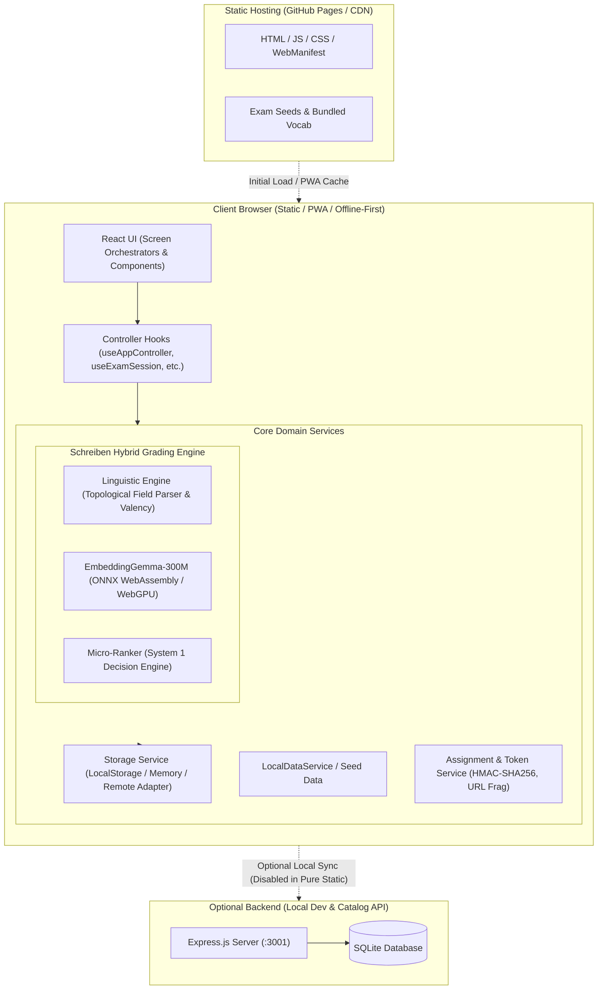
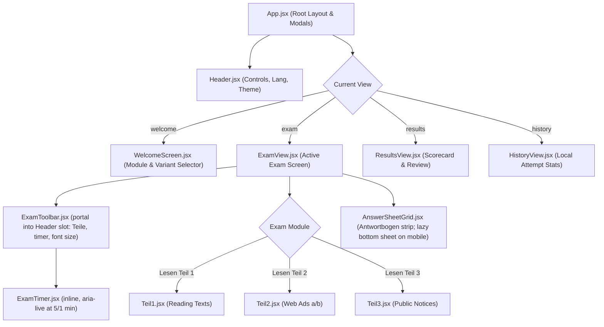
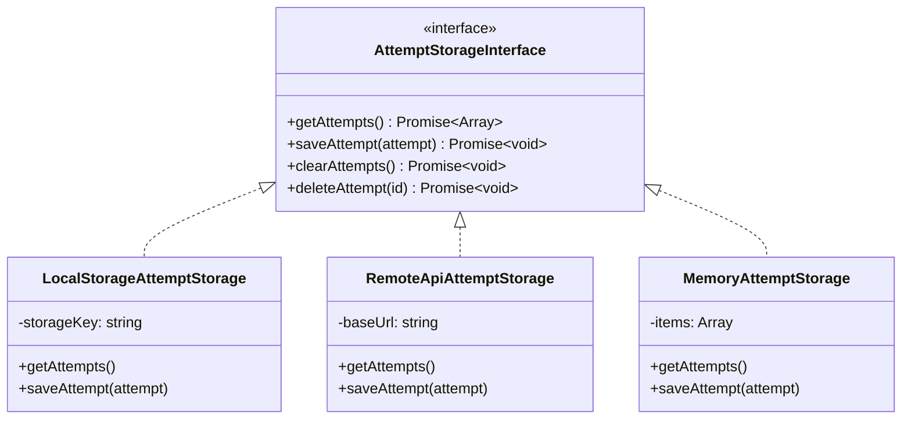
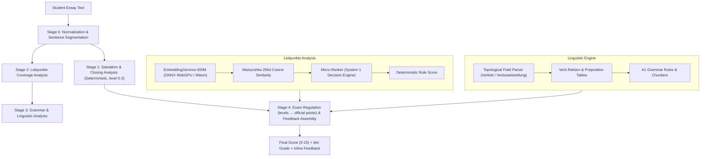
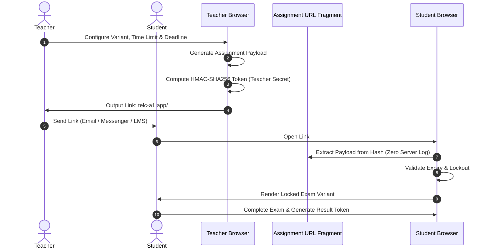

# System Architecture — telc Deutsch A1 Exam Simulator

This document provides a comprehensive overview of the architecture, subsystems, data flow, and design principles of the **telc Deutsch A1 Exam Simulator**. Russian version: `ARCHITECTURE.ru.md`; both are kept in sync.

---

## 1. Architectural Principles & Product Philosophy

The application is engineered around four non-negotiable principles:

1. **Browser-First & Serverless**: The entire core application—including exam delivery, evaluation, scoring, error analysis, history, and AI/WebGPU computation—runs completely in the client browser. It deploys as a static bundle to GitHub Pages.
2. **Offline-First & PWA**: After static assets and AI model weights are cached, the application functions with zero internet connectivity. Service Workers cache application shell assets, and models are stored in browser CacheStorage/IndexedDB.
3. **Zero-Knowledge Privacy**: Student exam attempts, typed essays, test history, and teacher assignment links are stored locally (`localStorage`) or encoded in the URL fragment (`#token=...`), ensuring no student private data leaks to a central server.
4. **Clean Architecture & McConnell Modularity**: Strict separation of concerns (SRP), Single Level of Abstraction (SLAP), small cohesive functions, and decoupled domain services wrapped behind clear interfaces.

---

## 2. High-Level System Architecture

```mermaid
flowchart TB
    subgraph Client["Client Browser (Static / PWA / Offline-First)"]
        direction TB
        UI["React UI (Screen Orchestrators & Components)"]
        Hooks["Controller Hooks (useAppController, useExamSession, etc.)"]
        
        subgraph Services["Core Domain Services"]
            ExamSvc["LocalDataService / Seed Data"]
            StorageSvc["Storage Service (LocalStorage / Memory / Remote Adapter)"]
            SecuritySvc["Assignment & Token Service (HMAC-SHA256, URL Frag)"]
            
            subgraph SchreibenEngine["Schreiben Hybrid Grading Engine"]
                NLP["Linguistic Engine (Topological Field Parser & Valency)"]
                Embeddings["EmbeddingGemma-300M (ONNX WebAssembly / WebGPU)"]
                MicroRanker["Micro-Ranker (System 1 Decision Engine)"]
            end
        end
        
        UI --> Hooks
        Hooks --> Services
        Services --> StorageSvc
    end

    subgraph StaticHost["Static Hosting (GitHub Pages / CDN)"]
        StaticAssets["HTML / JS / CSS / WebManifest"]
        PrecachedSeeds["Exam Seeds & Bundled Vocab"]
    end

    subgraph OptionalBackend["Optional Backend (Local Dev & Catalog API)"]
        Express["Express.js Server (:3001)"]
        SQLite[(SQLite Database)]
        Express --> SQLite
    end

    StaticHost -.->|"Initial Load / PWA Cache"| Client
    Client -.->|"Optional Local Sync (Disabled in Pure Static)"| OptionalBackend
```

---

## 3. Frontend Architecture

### 3.1 Screen Orchestration Pattern
The React presentation layer strictly follows the **Screen Orchestrator** pattern:
- Top-level screen components (`ExamView.jsx`, `WelcomeScreen.jsx`, `ResultsView.jsx`, `HistoryView.jsx`) contain minimal DOM and orchestrate modular subcomponents located in dedicated subdirectories (`components/welcome/`, `components/results/`, `components/exam/`, etc.).
- State and business logic are decoupled from rendering using custom React controller hooks:
  - `useAppController`: Global route/view coordinator, modal coordinator, and theme manager.
  - `useExamSession`: Active exam state, question answers, timer synchronization, and completion triggers.
  - `useExamLoader`: Dynamic loading and hydration of exam variants (Lesen, Schreiben, Stubs).
  - `useAssignmentMode`: Teacher-generated assignments, token parsing, and anti-tamper lockout validation. Every opened `#task=` link is also kept in `localStorage['telc_assignments']` (`services/storage/receivedAssignmentsStorage.js`) with its score after submission, so the home screen lists received assignments after the hash is gone.
  - `useWelcomeRole`: Student/teacher role (`localStorage['telc_welcome_role']`), switched in the header and read by `WelcomeScreen`; instances stay in sync through a window event.
  - Home scores (`utils/attemptStats.js`): best score per variant from attempt history, always against the module `maxScore` from `shared/testTypes.js` (Schreiben: 15 points over 6 tasks), never against the task count; `activityByExamId` (count, last date) feeds the desktop variant cards. `utils/moduleProgress.js` averages each Teil over the last 5 attempts (`results.teilBreakdown`), flags the weakest Teil only when it is behind another one, (before the first attempt the desktop shows an empty state so its band stays whole). Student home from 1024 px sits on the page grid: the briefing (module heading, then its parts in one strip, `ModuleStructureCards variant="strip"`), two bands — exam | from the teacher, progress by part | last 5 attempts (each row a grid: name and date, score, change against the previous try of the same variant, «Review») — and the variants across the full width. `welcome/student/TeacherTasksSection` holds the open module's received tasks as rows of one card with the link field folded at its foot, or an empty state with the field. Received (student) and issued (teacher) assignments follow the open module (`utils/moduleSplit.js`); the other modules' ones show as chips «Lesen · 1» that switch module (`welcome/OtherModulesHint`), so a task is never hidden silently. Teil titles for chips and progress: `config/teilTitles.js`.
- Responsive shell (phone `<640` / tablet `640–1023` / desktop `≥1024`): one container `components/layout/pageLayout.js` (`PAGE_CONTAINER` 75rem, `SCREEN_COLUMN` 45rem on tablets). All sizes are rem (Tailwind arbitrary values included, no `-[Npx]`): the root font size in `index.css` is 16 px up to 1600 px wide and then grows with the screen (`clamp(16px, 6px + 0.625vw, 32px)`: 18 px at 1920, 22 px at 2560, 30 px at 3840), so large monitors show the same layout proportionally larger instead of a 1200 px island; phones and tablets are unchanged. The footer is one quiet line on desktop (`Footer.jsx`). Desktop pages are built from bands of a 12-column grid (`pageLayout.js`: `PAGE_STACK`, `BAND`, `SPAN`): the blocks of a band stretch to one height and share their top and bottom edges; below 1024 px a band dissolves (`display: contents`) and its blocks join one stream by `order-*`. Every block is a `layout/Section`: the title above the frame (never inside it), an optional action in the title row that never makes the row taller, one frame (`card`, `desktop` = bare on phones, `none`) and one padding (24 px on desktop). Phones get `nav/MobileTabBar` (Home / History / Settings; settings is a lazy native-`<dialog>` sheet) instead of header buttons; from 1024 px the home module switch is a header tab row. The exam header is one row: under 1024 px ✕ · position · timer with a progress line; from 1024 px the answer strip (Lesen) or Teil tabs (Schreiben) sit in the header and the page ends with its own Back/Next (`exam/ExamPageNav`), the bottom bar is phone/tablet only and steps aside while a text field has focus (`useTextEntryFocus`).
  - `useAnswerSheet`: Teil groups, the question in view (pinned for a moment after a keyboard/sheet pick) and jumping to a question. `useExamHotkeys`: R/F and A/B/C answer, ↑/↓ question, ←/→ Teil; ignored while typing or with a dialog open. `useModalDialog`: native `<dialog>` with `showModal()` for sheets.
  - `useIssuedAssignments` + `services/storage/issuedAssignmentsStorage.js`: assignments a teacher issued from this browser (`localStorage['telc_issued']`, entry = link, variant, student, deadline, `submissions[]`). `createAssignmentLink()` in `assignmentTokenService` returns `{ assignmentId, url }`; the optional deadline travels in the token as `due` (not signed — a reminder, not an exam condition). When a `#review=` link of such an assignment is opened, `useReviewMode` records the submission (student, score, review token), so the teacher's list shows status, score or «N submitted · avg» for group links.
  - UI: `ui/Dialog` is a native `<dialog>` (`showModal()`: focus trap, Esc, inert page, focus return, `aria-labelledby`); bottom sheet below 640 px, centred window from 640 px. Share, legal and create-assignment modals load lazily from `AppModals`. `share/ShareLinkPanel` is the shared «ready link» block: one truncated line + Copy, `navigator.share` first on phones, Telegram/WhatsApp and a QR code from 640 px; `share/QrCodeImage` imports `qrcode` on demand (own chunk). Teacher key lives in Settings (`nav/TeacherKeySection`, header button for teachers from 640 px, tab bar on phones).
  - `useSchreibenSelfCheck`: criterion levels, grammar hints and the AI re-check state of one Schreiben letter. `onScoreChange` is read through a ref, so the score effect fires on real score changes only.
- Teacher home (`welcome/TeacherWelcomeView`): the same `ModuleHeading` as the student home with «Check a result link» and «New assignment» beside it, then two titled `Section`s — issued assignments of the open module and the variants catalog.
- Page grid rows are `layout/Band` (`align="stretch"`: shared top and bottom edge; `"start"`: top-aligned, for a sticky column), marked `data-band`. `npm run test:e2e:grid` (`tests/e2e/grid-alignment.test.js` on the shared `tests/e2e/cdpHarness.js`; set `CHROME_PATH`) checks the student homes, the teacher home and history at 1440 / 1920 / 390 px: one top (and bottom) edge per band, bands on the grid edges, `display: contents` below 1024 px, no sideways scroll.
- Type scale (`layout/typography.js`): `PAGE_TITLE` (one h1 per screen), `PAGE_LEAD`, `SECTION_TITLE` (block title above its frame; re-exported by `layout/Section`), `CARD_TITLE` (inside a card or banner), `PART_TITLE` (exam part banners), `DIALOG_TITLE` and `NUMERIC` (tabular figures for scores, counts, dates and timers); headings take their size and weight from these tokens only (bold, no black/extrabold).
- History screen: on the page grid — page title (`layout/typography.js`: `PAGE_TITLE`, `PAGE_LEAD`) with the local-storage note as its lead line, the four figures as one strip (`HistoryStatsGrid`, 2 × 2 on phones), and the attempt list as a `Section` with clear / refresh in its title row.
- Lesen exam: parts stack with the page rhythm (`PAGE_STACK`); the Teil 1 text | questions and the Teil 3 sign | statement cards split 7/5 with the page spans (`SPAN.wide` / `SPAN.narrow`), so the divider sits on one line across parts; Teil 2 keeps both web pages side by side across the full width.
- Results screen: on the page grid (`PAGE_STACK`); one band holds `ResultsHeroCard` (8 columns: score, pass status, `ScoreThresholdBar`, per-Teil cells in one row) and `ResultsActionBar` (4 columns, same height: one primary action, send to teacher, quiet links; full width when there are no actions). The task review is a `Section` titled above its card. Lesen uses `ResultsReviewList` (filter opens on "mistakes" after a failed attempt); Schreiben uses `results/schreiben/SchreibenResultsBody` (below 1024 px a Form / Letter switch; from 1024 px the parts keep the exam order: the Teil 1 table (five fields side by side) first, then the letter as one band of the page grid (`BAND_TOP`, top-aligned) — conclusion and criteria (5 columns) beside the sticky texts (7), which are stacked at 1024–1279 px and side by side from 1280 px — and the details full width below; texts side by side from 768 px; phones get the two main actions in a bottom bar; a met criterion shows no note, only missing points are explained) — Teil 1 as one table (`SchreibenFormReviewTable`), the letter review open from the start (`SchreibenSelfCheck`: conclusion → criteria → texts with credited phrases marked via `utils/letterHighlights.js` → collapsed details). Ranker internals and the A/B card render only with `?debug` (`utils/debugFlag.js`); the learning accuracy scale is not rated when no Leitpunkt is covered.
  - `useSchreibenAiChecker`: Orchestrates the asynchronous multi-stage evaluation pipeline.

### 3.2 Component Hierarchy

```mermaid
graph TD
    App["App.jsx (Root Layout & Modals)"]
    App --> Header["Header.jsx (Controls, Lang, Theme)"]
    App --> ViewSelector{Current View}
    
    ViewSelector -->|welcome| WelcomeScreen["WelcomeScreen.jsx (Module & Variant Selector)"]
    ViewSelector -->|exam| ExamView["ExamView.jsx (Active Exam Screen)"]
    ViewSelector -->|results| ResultsView["ResultsView.jsx (Scorecard & Review)"]
    ViewSelector -->|history| HistoryView["HistoryView.jsx (Local Attempt Stats)"]
    
    ExamView --> ExamToolbar["ExamToolbar.jsx (portal into Header slot: Teile, timer, font size)"]
    ExamToolbar --> ExamTimer["ExamTimer.jsx (inline, aria-live at 5/1 min)"]
    ExamView --> ActiveModule{Exam Module}
    
    ActiveModule -->|Lesen Teil 1| Teil1["Teil1.jsx (Reading Texts)"]
    ActiveModule -->|Lesen Teil 2| Teil2["Teil2.jsx (Web Ads a/b)"]
    ActiveModule -->|Lesen Teil 3| Teil3["Teil3.jsx (Public Notices)"]
    ExamView --> AnswerSheet["AnswerSheetGrid.jsx (Antwortbogen strip; lazy bottom sheet on mobile)"]
```

### 3.3 Interface Contracts & Contract Guard
Core ports and adapters declare formal contract specifications in `src/contracts/` (`timerContract`, `sessionContract`, `loaderContract`, `assignmentContract`, and `screenContracts`). At build time, `scripts/verify-contracts.js` statically verifies method invocations and screen DTO completeness, aborting the build on any contract drift.

### 3.4 Theme Initialization & Zero-FOUC Architecture
To eliminate white canvas flashing (FOUC / FART) upon desktop browser reload:
- `<meta name="color-scheme" content="dark light" />` placed in `<head>` immediately initializes the Chromium/WebKit document canvas to dark mode.
- Synchronous render-blocking script `public/theme-init.js` (``) resolves `localStorage` and `prefers-color-scheme` before the initial layout paint, toggling `.dark`/`.light` and setting `root.style.colorScheme`.
- Static and CSP-compliant (`script-src 'self'`), without asynchronous module bundling delays.

---

## 4. Storage & State Abstraction

The storage layer implements the **Strategy Pattern** via a unified `AttemptStorageInterface`:

```mermaid
classDiagram
    class AttemptStorageInterface {
        <<interface>>
        +getAttempts() Promise~Array~
        +saveAttempt(attempt) Promise~void~
        +clearAttempts() Promise~void~
        +deleteAttempt(id) Promise~void~
    }
    class LocalStorageAttemptStorage {
        -storageKey: string
        +getAttempts()
        +saveAttempt(attempt)
    }
    class RemoteApiAttemptStorage {
        -baseUrl: string
        +getAttempts()
        +saveAttempt(attempt)
    }
    class MemoryAttemptStorage {
        -items: Array
        +getAttempts()
        +saveAttempt(attempt)
    }
    
    AttemptStorageInterface <|.. LocalStorageAttemptStorage
    AttemptStorageInterface <|.. RemoteApiAttemptStorage
    AttemptStorageInterface <|.. MemoryAttemptStorage
```

- **LocalStorageAttemptStorage** (Default): Browser-local storage; requires no network, completely private.
- **RemoteApiAttemptStorage**: Connects to the optional local Express REST backend.
- **MemoryAttemptStorage**: Ephemeral storage used for isolated tests and headless verification.
- **AssignmentLockoutStorage**: Stores completion tokens for teacher assignments to prevent duplicate submissions.

---

## 5. Schreiben Hybrid Grading Architecture

The essay evaluator (*Schreiben Teil 2*) runs 100% in-browser using a multi-stage hybrid engine combining deterministic German linguistic models with local WebAssembly/WebGPU models.

### 5.1 Pipeline Flowchart

```mermaid
flowchart TD
    Input["Student Essay Text"] --> S0["Stage 0: Normalization & Sentence Segmentation"]
    S0 --> S1["Stage 1: Salutation & Closing Analysis (Deterministic, level 0-2)"]
    
    S0 --> S2["Stage 2: Leitpunkte Coverage Analysis"]
    subgraph S2_Details["Leitpunkte Analysis"]
        Embed["EmbeddingGemma-300M (ONNX WebGPU / Wasm)"]
        Cos["Matryoshka 256d Cosine Similarity"]
        Ranker["Micro-Ranker (System 1 Decision Engine)"]
        Embed --> Cos --> Ranker
        Ranker --> CodeScore["Deterministic Rule Score"]
    end
    
    S2 --> S3["Stage 3: Grammar & Linguistic Analysis"]
    subgraph S3_Details["Linguistic Engine"]
        Topo["Topological Field Parser (Vorfeld / Verbzweitstellung)"]
        Valency["Verb Rektion & Preposition Tables"]
        Grammar["A1 Grammar Rules & Chunkers"]
        Topo --> Valency --> Grammar
    end
    
    S1 & S2_Details & S3_Details --> S4["Stage 4: Exam Regulation (levels → official points) & Feedback Assembly"]
    S4 --> Output["Final Score (0-15) + telc Grade + Inline Feedback"]
```

### 5.2 Linguistic Engine (No Fragile Regexes)
In compliance with project standards, natural language evaluation avoids ad-hoc regex patching:
- **Topological Field Parser & Proposition Deconstructor (`topologicalFieldParser.js`, `clauseStructureParser.js`)**: Identifies sentence fields (*Vorfeld*, *Linke Satzklammer* (finite verb in position 2), *Mittelfeld*, *Rechte Satzklammer* (participle/infinitive), and *Nachfeld*), tracks coordinated subordinate clause scopes, and extracts predicate cores, arguments, and temporal markers.
- **Semantic Intent Matcher & Polarity Validator (`semanticIntentMatcher.js`, `semanticPolarityValidator.js`)**: Evaluates structural polarity (*Satznegation* with `nicht` in pre-verbal Mittelfeld, *Nominalnegation* with `kein*`, and defect vs positive states). Compares clause structures against Leitpunkt intent contracts (`DEFECT_REPORT`, `ACTION_REQUEST`, `APPOINTMENT_CANCEL`, `APPOINTMENT_PROPOSAL`), deterministically preventing LLM sycophancy, semantic inversion, and cross-criterion token leakage.
- **Criterion-anchored refusals (`criterionRequestTargets.js`, v0.7.16)**: an `ACTION_REQUEST` refusal (`negated_entity` / `negated_action`) fires only when the negated noun or verb matches the criterion's own rubric `keywords` (stemmed; separable verbs also match by their base verb, e.g. `kommen Sie … vorbei` → `kommen`). The code holds no domain word lists: what a Leitpunkt is about lives in rubric data, and a criterion without keywords never produces a refusal. So "ich kann nicht zum Kurs kommen" cannot refuse a "Hausaufgaben" point.
- **Polarity gate (`grading/criterionPolarityGate.js`, v0.7.16)**: the single frame/inversion check for Leitpunkt evidence, shared by `pipelineStageScorers.js` and `stage2Leitpunkte.js`. Vector matching (cosine ≥ 0.35) can pull unrelated sentences into a criterion's evidence, so a refusal zeroes the point **only when no affirmative keyword evidence exists** for that criterion. Frame (conversive-rule) penalties are unchanged.
- **Refusal detector for every intent (`criterionRefusalDetector.js`, v0.7.18)**: the criterion-anchored refusal now applies to every Leitpunkt intent, not only `ACTION_REQUEST`. Three structural rules against the rubric targets: `negated_entity` (target noun under `kein`), `negated_action` (clause with `nicht` whose predicate is a target) and `negated_participant` (clause with `nicht` whose subject is a target, e.g. "Meine Schwester kommt nicht" for "Begleitperson"). Complements under `nicht` are deliberately ignored ("nicht am Montag" contrasts, it does not refuse). Which negations *express* a speech act instead of refusing it is declared once in `INTENT_POLARITY` (`semanticIntentMatcher.js`): cancellations and reasons are carried by any negation, a defect report only by a negated function ("funktioniert nicht"), never by a negated problem ("kein Problem"). Only `ACTION_REQUEST` refusals map to `LP_INVERTED_REQUEST`; all others map to `LP_INVERTED_GENERAL`.
- **Dual Scale Architecture (v0.7.24)**:
  - **Official telc A1 Grade (0–10)**: Governed strictly by `telcA1Regulation` based on CEFR A1 communicative achievement (3 Leitpunkte × 3 pts + Framing 1 pt). Grammar and syntax errors do not lower the official score unless the message is obstructed.
  - **Linguistic Accuracy (0–10 / %, `linguisticAccuracyScorer.js`)**: pedagogical defect density, independent of the official score. v0.7.25: one defect flagged by two analyzers counts once (`linguistic/grammarErrorDeduper.js`: same code over overlapping text — one span contains the other or they overlap at the edge; shared words alone are two defects, v0.7.33; applied in the shared `mergeCandidateGrammarErrors`, so the listed errors, the examiner feedback and the badge agree in every grading path), the density uses the letter body (`scoring/letterBodyWordCounter.js`, same count in pipeline and UI), defects are weighted by category — the weights are level data, `accuracyWeights` of the grammar profile (`profiles/index.js` → `getGrammarProfile(level)`, v0.7.33; A1: syntax 1.5, case/agreement 1.0, spelling 0.5) — and the same profile weights are used by the pipeline and the UI panel, and the penalty is normalised per 30 words of the letter body (short texts are not scaled up). The scorer returns a band key; labels live in i18n (`results.linguisticAccuracy`). The UI shows it in its own panel (`LinguisticAccuracyPanel.jsx`, v0.7.27), separate from the telc exam score and labelled as not affecting it: score, band bar (from `ACCURACY_BAND_THRESHOLDS`), per-category breakdown (`byCategory`: count × weight) and a collapsible "how it is calculated". It is computed from the same error list that `SchreibenGrammarNotice` shows.
- **Explicit Compound Criterion Aspects (`aspects: [...]`, v0.7.24)**: Multi-faceted Leitpunkte (e.g. "Personen und Zeitraum", "Preis und Haustiere") explicitly define sub-aspects in rubric seeds. This prevents keyword loss during decomposition and enables precise sub-aspect query formation in Micro-Ranker.
- **Temporal expression detection (`temporalRangeDetector.js`, v0.7.25; replaces the v0.7.24 `TEMPORAL_RANGE_REGEX`)**: token-based. A range needs calendar boundaries (day number, `DD.MM.`, month, ordinal word) around `bis` / `-` / `bis zum`, so `vom 15.07. bis 25.07.` is a period and `von Hamburg bis Kiel` or `4 bis 5 Personen` is not. A calendar point is a temporal preposition + anchor (`am Montag`), a clock time (number + `Uhr`: `ab 18 Uhr`), or a relative day adverb (`morgen`, `heute`) — only the lower-case adverb or a sentence-initial word, so the noun in `Guten Morgen` is no time (v0.7.37). The `zeit` concept domain holds months, weekdays and seasons, but no function words (`vom`, `bis`, `ab`).
- **Grammar engine (`linguistic/grammarEngine.js`, v0.7.28)**: level-independent. `createGrammarEngine(profile)` tags a sentence with the profile's lexicon port (`{ lookup, findForms, tag }`), analyses it once and runs the rules the profile enables.
  - *Data* (German language, level-free): `linguistic/data/declensionParadigms.json` (determiner, adjective and noun declension; cardinals) and `prepositionContractions.json`. Level data: the A1 lexicon (noun gender/number/`plural`, weak masculine `obliqueForm`, verb `objCase` / `ditransitive`, calendar and duration categories).
  - *Analysis*: `analysis/nounPhraseChunker.js` ([preposition] [determiner] [cardinal] adjective* noun, pronouns, dates), `morphology/*` (which case/gender/number a form expresses, and the form a case requires), `analysis/clauseContext.js` (clause spans, the verb whose frame governs objects), `analysis/caseGovernor.js` (required case from the preposition's `prepCase` or the verb frame; subjects, time adverbials and pre-verbal phrases are not verb-governed).
  - *Rules* (`grammarRules/`, one contract `{ id, check(analysis, { lexicon, policy }) }`): `nounPhraseCase` (case and agreement, corrections generated from the paradigms — "ein kleiner Hund" → "einen kleinen Hund", "mit zwei Kinder" → "mit zwei Kindern"), `calendarArticle` ("von 15. Juli" → "vom 15. Juli", "in Juli" → "im Juli"), `numeralPlural`, `countability`, `subjectVerbAgreement` (lenient over pronoun/verb homographs), `measurePhraseOrder` ("Zeit vier Wochen" → "vier Wochen Zeit"), `verbFrame` (v0.7.30; lexicon `reflexive` / `prepObject` / separable prefixes: "mich anmelden", "für den Kurs anmelden", "rufen Sie mich zurück"), `determinerlessCountNoun` (lexicon `countable`: "einen Deutschkurs machen"). "für August" is not flagged: it is correct German.
  - *Letter zones* (v0.7.32): `linguistic/data/letterFormulas.json` (salutation and closing formulas as word sequences with register; `*` allows an inflection ending) is the single source for `macroSegmenter.js`, which segments and rates the register (the former `communicationRegister.js` regexes are gone). Letter rules (`letterRules/`, contract `{ id, check(letter, { lexicon, policy, checkSentence }) }`, `letter = { salutation, closing, bodySentences }`): `salutationAgreement` (strong nominative ending of the addressee's gender — "Sehr geehrter Herr", "Liebes Praxis-Team"), `salutationCommaCase` (lower case after "Hallo Anna,"; nouns, polite *Sie* forms and unknown names keep the capital), `closingFormula` (no comma after the formula; the formula's own case through the sentence rules — "Mit freundlichen Gruß" → "Mit freundlichem Gruß"), `nounCapitalization` (a lower-case word whose every lexicon reading is a noun), `umlautSpelling` (an unknown word that is a known word without its umlaut: "fur" → "für", "Grusse" → "Grüße"; *ue/ss* spellings are correct). `data/umlautSpelling.json` holds the letter tables.
  - *Word order* (v0.7.29) is checked only by the topological parser: one Vorfeld constituent (a PP after a noun phrase is its attribute), a sentence-initial coordinator is position 0, a resumptive subject pronoun is `ERR_DOUBLED_SUBJECT`, subordinate clauses end in the finite verb (`subordinateClauseChecker.js`, lexicon-aware for infinitive homographs), and bracket errors quote the whole bracket from the finite verb. Whether a prepositional phrase after the infinitive (Ausklammerung) is an error is the profile's `strictSatzklammer` policy. The regex `syntaxRuleChecker` and `agreementRuleChecker` were removed.
  - *Level profile* `profiles/a1GrammarProfile.js`: lexicon port, enabled sentence and letter rules, tolerances (A1 accepts the dative after genitive prepositions; `strictSatzklammer: true`). A2/B1 add a profile, not engine code. `verify:contracts` checks the data shape and that profiles name existing rules; `scripts/contracts/levelFreeEngineContract.js` (v0.7.43) scans every module of `services/schreiben` and rejects any level reference outside the level data and bindings (`grading/policies/`, `profiles/`, `regulations/`, `linguistic/a1LexiconService.js`, `germanGrammarChecker.js`).
  - *Orchestrator* (v0.7.33) `linguistic/grammarCheckOrchestrator.js`: `createGrammarChecker(profile)` → `{ checkLetter(text), findSalutationDeclensionError(line) }` segments the letter, runs the topological parser (lexicon port injected: `parseSentenceTopology(sentence, { lexicon, policy })`) and the sentence rules on body sentences, the letter rules on the zones, and dedupes once. `germanGrammarChecker.js` only binds it to the A1 profile for tests and tools. On the semantic side `clauseStructureParser.parseSentencePropositions(sentence, { lexicon })` gets the lexicon from `IRankerPolicy.lexicon` (Micro-Ranker) and so do `semanticIntentMatcher` / `semanticPolarityValidator` (`detectSemanticInversion(sentence, criterion, { lexicon })`).
  - *Level context* (v0.7.41) `levelContext.resolveLevelContext(question.level)` → `{ level, policy, lexicon, grammar }` is the one place that maps a task level to its ranker policy and grammar checker (through the policy and profile registries). The entry points resolve it from the task — `gradingPipeline`, `evaluateTeil2Essay` (rules-only), `schreibenMicroPipeline`, `gradingFacade` — and pass it down: `runDeterministicBaseline(text, criteria, levelContext)`, Stage 0/2/3, `segmentUserEssay`, `analyzeLeitpunkte`, `analyzeSalutation({ grammar })`, the compound baseline and the Micro-Ranker (`classifyCoverage(lp, sentences, { policy })`). Engine functions have no level default: a missing port fails fast (`grading/levelPorts.requireLevelPort`).
  - *Rubric data, not label guessing* (v0.7.34) `linguistic/criterionIntents.js`: every Schreiben Leitpunkt declares `intent` (`DEFECT_REPORT`, `ACTION_REQUEST`, `APPOINTMENT_CANCEL`, `APPOINTMENT_PROPOSAL`, `INFORMATION_REQUEST`, `REASON_EXPLANATION`, `GENERAL`) and, where a detector proves it, `evidence: 'temporal' | 'personCount' | 'occupation'` on the criterion or on an aspect (`resolveAspectEvidence`: aspect first, then criterion; aspects may be declared by label only, keyword partitioning is unchanged). The ranker (`computeFallbackEvidence(aspect, sentence)`), the compound baseline and the keyword stages read these fields; no module infers them from label wording. `verify:contracts` (`scripts/contracts/rubricContract.js`) rejects seed rubrics without a valid intent/evidence. Question form for Leitpunkt segmentation comes from the clause type (`linguistic/sentenceMood.js`: `?`, V1 question/imperative, or an interrogative in the Vorfeld), and only speech acts addressed to the reader (`ACTION_REQUEST`, `APPOINTMENT_PROPOSAL`, `INFORMATION_REQUEST`) get the question bonus.
  - Regression net: `tests/grammar-snapshot.test.js` pins the checker output on every fixture letter (each diff is reviewed), `tests/grammar-targets.test.js` holds target cases per refactoring stage. The regex checkers of `rules/` are gone (v0.7.32).
- **Orthography & Agreement**: Analyzes subject-verb agreement and noun capitalization.

### 5.3 Hardware Runtime Adaptation & Fallback Matrix

| Environment | Embeddings Engine | Decision Engine | Mode |
| :--- | :--- | :--- | :--- |
| Modern WebGPU / Wasm (Production Default) | Transformers.js (WebGPU/Wasm) | Micro-Ranker (EmbeddingGemma 300M q4) | **Micro-Ranker Decision Mode (Active)** |
| WebGPU Unsupported / Older Browser | Transformers.js (Wasm Fallback) | Micro-Ranker (EmbeddingGemma Wasm) | **Micro-Ranker (Wasm Fallback)** |
| Low Memory / Deterministic Only | Deterministic Keyword Matcher | Deterministic Baseline | **Limited Deterministic Mode** |

Runtime capability is determined strictly via runtime detection (`navigator.gpu` + `requestAdapter()`), avoiding brittle user-agent sniffing.

### 5.4 Canonical Prompt Architecture & Arbitration Contracts
To ensure strict adherence to Single Responsibility Principle (SRP) and prevent contract divergence across providers:
- **Single Source of Truth (`src/services/schreiben/grading/prompts.js`)**: All prompt templates for Leitpunkt arbitration, grammar suggestions, and feedback verbalization are consolidated in a unified module.
- **Balanced Gray-Zone Arbitration**: The Leitpunkt prompt enforces balanced few-shots (1 full, 1 partial, 1 no) to eliminate frequency bias towards `full`.
- **Semantic Similarity Calibration**: EmbeddingGemma task prefixes are calibrated to `task: sentence similarity | query:` and `task: sentence similarity | text:` according to the official model specification.
- **Fail-Safe Fallbacks**: Malformed or damaged LLM outputs fall back to `null` to ensure deterministic baseline scores are preserved without artificial score inflation.

### 5.5 Dual-Track Feedback Architecture: telc Examiner Report & Localized Tutor Notes
To preserve official telc A1 authenticity while providing maximum pedagogical clarity to language learners:
- **Official Examiner Report (Prüfer-Feedback)**: Assembled in authentic A1 German (`stage4Feedback.js` / `feedbackVerbalizer.js`), reflecting official telc criteria terminology and fact-locked verbalization.
- **Diagnostic Code Contract (`feedbackContracts.js`)**: Linguistic evaluation emits immutable diagnostic codes (`LP_FULFILLED`, `LP_PARTIAL`, `LP_MISSING`, `LP_INVERTED_DEFECT`, `LP_INVERTED_REQUEST`, `LP_FRAME_VIOLATION`, `ANREDE_PERFECT`, `ANREDE_REGISTER_MISMATCH`, `ANREDE_DECLENSION_FLAW`, `ANREDE_PUNCTUATION_FLAW`, `GRUSS_PERFECT`, etc.) along with assigned sentences.
- **Pure Tutor Feedback Resolver (`tutorFeedbackResolver.js`)**: Formats 1 clear, compassionate sentence per criterion in the student's selected interface language (`ru`, `en`, `de`), quoting relevant phrases when errors or inversions occur without hallucination.
- **Interactive Criteria Checklist (`SchreibenCriteriaChecklist.jsx`)**: Renders inline tutor notes directly below each criterion score badge for instant self-assessment and review.
- **Structured Examiner Feedback (v0.7.17)**: `IRankerPolicy.buildExaminerFeedback(facts)` (called from `grading/pipelineFeedback.js`, independent of the active provider, so it also works in limited mode) returns a language-neutral descriptor `examiner_feedback = { version, summary: [{code, params}], bullets: [{category, status, code, params}] }`. `feedback/examinerFeedbackBuilder.js` picks the codes (overall verdict → content → framing → grammar, max 4 summary sentences); params hold only verbatim German fragments of the letter (`quote`, `correction`) and rubric labels. Grammar highlights (`grammarHighlightSelector.js`) are chosen by checker `code`/`category`, never by parsing explanation text. `examinerFeedbackRenderer.js` + `examinerPhraseBank.js` (RU/EN) render the text **at display time** in the current UI language, so switching language needs no re-grading and stored attempts stay renderable. `SchreibenExaminerFeedbackCard.jsx` shows the summary plus quoted bullets and falls back to the legacy German `feedback_summary`, which is unchanged.

### 5.6 Confidence Floor Guardrail & Macro-Segment Grounding
To prevent aggressive false-negative penalties by edge LLMs (e.g. Qwen 0.6B) while preserving strict resistance to adversarial gaming:
- **Macro-Segment Grounding & Satellite Continuation (`schreibenTextSegmenter.js`)**: Assigns user sentences to criteria based on discourse cohesion. Unassigned elaboration clauses (satellites, e.g. appointment availability times like *"Ich bin ab 18 Uhr zu Hause"*) attach to the active discourse topic segment rather than being dropped as orphans, ensuring the LLM arbiter receives full context.
- **Confidence Floor Guardrail (Monotonic Rescue Principle)**: When the deterministic linguistic engine validates affirmative relevance with no semantic inversion (`baselineScore >= 1`, `penalty === 0`), the micro-LLM is permitted to upgrade/rescue ($0 \rightarrow 1$, $0 \rightarrow 2$, $1 \rightarrow 2$) but is strictly prohibited from demoting below the verified baseline score. Demotion to 0 is reserved exclusively for deterministic semantic inversions (`isInverted: true`) or completely missing text.
- **Compound cap exception (`leitpunktArbitration.mergeArbitrationVerdict`)**: when a compound criterion has a missing aspect (`isCompound && missingAspects.length > 0`), the merged level is capped at partial (1.5 points on telc A1) even if the keyword baseline was full: a compound point is full only when every aspect is addressed.
- **Protection Telemetry (`diff_summary`)**: `mergeArbitrationVerdict` returns `rankerScore` and `isProtected`. An item is tracked as `{ change: 'protected', rankerScore }` only when the provider verdict was below the baseline, and the UI shows that verdict next to the kept points (no misleading "2 ➔ 2").

### 5.7 Pluggable Decision Model & A/B Testing Architecture
To support high-throughput, deterministic evaluation without the resource footprint of autoregressive LLMs:
- **System 1 Decision Model (`MicroRankerProvider.js`, `microRankerService.js`, v0.7.15)**: Scores coverage from the calibrated cosine(EmbeddingGemma query, sentence) and deterministic evidence, merged by the level policy (`IRankerPolicy.combineEvidence`, v0.7.25; before that a plain `max`). The query is the criterion label plus its rubric `keywords` (`rankerFallbackScorer.formatCriterionQuery`). The ranker owns no model: it receives an **embedder port** (`embeddings/rankerEmbedder.js`, `{ embedQuery, embedText }`) backed by the same EmbeddingGemma instance as Stage 2 and pre-seeded with Stage 2 sentence vectors, so no second model download and no sentence is embedded twice (~4 ms extra per letter in the 30-letter benchmark). The former `Xenova/ms-marco-MiniLM-L-6-v2` was removed: it was loaded via `text-classification`, whose softmax over a single logit always returned 1.0, and it was English-only.
- **Primary vs. gray-zone arbitration (`leitpunktArbitration.js`)**: `micro_ranker` evaluates **every** Leitpunkt (cheap, deterministic). Generative providers (`window_ai`, `client_webgpu`) are still invoked only in the ±0.06 gray zone to avoid multi-second latency. Frame penalties / semantic inversions skip arbitration (score already forced by the linguistic engine).
- **Competitive gate**: EmbeddingGemma ranks sentences well (argmax criterion = gold on 10/10 labelled sentences) but its absolute cosine is not comparable across criteria. A sentence therefore only earns neural credit for the Leitpunkt it is closest to among the task's criteria (`rivalCriteria`).
- **Ranker as arbiter (v0.7.25)**: deterministic evidence is split by trust. *Lexical* (keywords, concept stems, label overlap) only shows the topic is touched; *structured* (`temporalRangeDetector.js`: date range / duration / calendar point, `personCountDetector.js`: numeral + person noun, `occupationDetector.js`: occupation noun, "arbeiten als/bei/beim/im …", "von Beruf", studying) proves the aspect is stated. When the embedder judged a sentence and rejected it (calibrated score < partial), a lexical-only hit is capped below full and flagged `rankerVeto` (`A1RankerPolicy.isLexicalVeto`); structured evidence still stands. A sentence claimed by a rival criterion gives no verdict, not a rejection. In `mergeArbitrationVerdict` the primary ranker may now **lower** the keyword baseline: its `no` verdict sets the point to 0, and a compound point with a vetoed aspect is capped at partial. Both apply only when the level policy trusts the verdict on those sentences (`IRankerPolicy.isVerdictReliable`; A1: ≤ 30 % words outside the A1 lexicon, because EmbeddingGemma reads typo-heavy letters as noise while the regulation gives full points to understandable text). Gray-zone providers keep the confidence floor. Benchmark: primary 147/169 → 152/169 on the existing letters with no new mismatches, plus the new regression cases 18–20.
- **Clause candidates (v0.7.25)**: every sentence is also judged clause by clause (`clauseStructureParser.parseSentencePropositions`), because a sentence joining two aspects ("Wie viel kostet der Kurs und wie kann ich mich anmelden?") dilutes a whole-sentence embedding.
- **Keyword partitioning for compound criteria (`rankerFallbackScorer.partitionAspectKeywords`)**: optional explicit rubric `aspects: [{ label, keywords }]` → concept-lexicon domain → nearest aspect by embedding. No ad-hoc regex (AGENTS.md §8).
- **Model choice record (v0.7.15)**: a multilingual cross-encoder (`cross-encoder/mmarco-mMiniLMv2-L12-H384-v1`, Apache-2.0) was benchmarked on the same hard negatives: near-zero absolute scores for rubric-style queries (0.000–0.28), wrong argmax on several pairs, and only an fp32 ONNX (~470 MB) is usable in the browser. EmbeddingGemma was kept.
- **Compound Criterion Decomposition (`compoundCriterionDecomposer.js`)**: Decomposes composite exam criteria (e.g. *"Personen und Zeitraum"*, *"Preis und Haustiere"*) into atomic sub-aspects, scoring them independently and aggregating with `A1RankerPolicy.aggregateCompound`: *full* only when every aspect is full (score = min), *partial* when at least one aspect reaches partial (the score is then a clamped placeholder in 0.40–0.55, shown in the UI as a verdict, not a percentage), otherwise *no*. This prevents a single aspect from awarding full points for an incomplete answer.
- **Deterministic Compound Baseline Evaluation (`compoundBaselineEvaluator.js`, v0.7.20, v0.7.35)**: Integrates compound criterion decomposition and synchronous keyword partitioning (`partitionAspectKeywordsSync`) directly into the instantaneous Stage 0-2 baseline calculation (`runDeterministicBaseline` / `evaluateTeil2Essay`). Since v0.7.35 Stage 2 of the pipeline (`pipelineStageScorers.js`) applies the same compound cap (the baseline point is the minimum of the similarity level and the compound verdict), so the rules-only and the pipeline baseline agree on a missing aspect. Whether a gray-zone provider reviews the point is decided explicitly (`shouldArbitrateLeitpunkt({ baselineScore, isCompound })`: a missing aspect is settled, a full similarity capped at partial is reviewed); the reported similarity is never rewritten (v0.7.36).
- **Concept domains (`conceptDomainScorer.js` + `policies/a1ConceptDomains.js`, v0.7.42)**: the level's vocabulary stem clusters (persons, occupation, time, price, pets, acceptance of an invitation, registration, reasons, places) come from `IRankerPolicy.conceptDomains`; the scorer only matches them. A domain stem proves a concept as the whole word or as the right-hand head of a compound (`Kurskosten` → Kosten, `Haustiere` → Tier), never as a substring (`Steuer`, `Hausaufgaben`, `Klavier`); numerals and function words match whole words only (v0.7.38).
- **Unproven counted evidence (`IRankerPolicy.capUnprovenLexical`, v0.7.39)**: for an aspect declaring `evidence: 'personCount'` or `'occupation'` that the detector did not prove, A1 bounds lexical hints at its partial threshold ("wir", "mit meiner Familie" answer "how many persons" only partly; "wir arbeiten beide" names no occupation, v0.7.45). The bound is level policy, not a constant in the scorer.
- **Declared evidence gate (`hasDeclaredEvidenceSupport`, v0.7.46)**: a single (non-compound) criterion that declares `evidence` is supported only when its detector or its own keywords/concepts find it somewhere in the body. Otherwise Stage 2 sets it to 0 and no provider arbitrates it: similarity to the criterion query ("mein Sohn ist krank" next to "Wie lange Sie fehlen") does not state how long.
- **Keyword match guarded by word class (`linguistic/keywordStemMatcher.js`, v0.7.47)**: Stage 2 keyword counting and the ranker's lexical score match rubric keywords by stem only when the lexicon port does not know one word solely as a noun and the other solely as a verb. The stemmer still folds "Anmeldung"/"anmelden" (rubrics that mean both list both forms), but "Ich wohne in Berlin" no longer covers the keyword "Wohnung". Words outside the lexicon keep the plain stem match.
- **Compound aspects read affirmed clauses only (v0.7.48)**: the Stage 2 compound baseline and the arbiter receive `extractAffirmativeText` of each sentence, so a refused clause ("ich kann leider nicht kommen") does not prove "Zusage". An aspect that no rubric keyword belongs to is judged by its label and concept domain, as in the ranker, and no longer borrows its sibling's keywords ("Dank" proving "Zusage"). A1 gains a `zusage` concept domain (zusag, gern, dabei, teilnehm; a bare "kommen" is also origin or a companion, so it is not in it).
- **Aspect concept evidence in retrieval and segmentation (`grading/aspectConceptEvidence.js`, v0.7.50)**: a sentence that states an aspect of a criterion through the level's concept domains or a structured detector is evidence like a rubric keyword. Stage 2 adds it to the criterion's relevant sentences (so "Ist die Wohnung billig?" reaches "Preis und Haustiere" in limited mode, not only through the embedding), and the segmenter (`semanticTopicMatcher`) weighs it like one keyword, so the question is no longer assigned to the reason by its noun "Wohnung". The compound evaluator still caps the criterion by its weakest aspect. A1's `preis` domain drops the bare stem "viel" ("Vielen Dank", "viele Fragen"); "Wie viel kostet …" is proven by "kost". A month alone ("im August", "im Juli") remains a Zeitraum: the reference case 02 of the Ostsee suite sets it as full; changing that needs a regulation source, not one letter.
- **Leitpunkt precision (P1, v0.7.74–v0.7.83)**:
  - *Rival attribution* (`grading/rivalEvidence.js`): temporal and concept evidence skip a sentence that fully states another Leitpunkt's keywords and none of the scored one's. The date of the cancelled appointment ("Termin am Montag absagen") is no proposal of a new one and no longer shields a refusal.
  - *Phrase keywords* (`keywordStemMatcher.js`): a multi-word keyword ("nächste woche") matches its words in a row, each by stem and word class.
  - *Keyword concepts* (`linguistic/keywordConcepts.js`, v0.7.84): rubric keywords that share a lemma in the lexicon port or a stem are one concept ("kosten"/"kostet"). Stage 2, rival attribution and the rules-only analyzer count distinct concepts, and `keywordThreshold(criterion, lexicon)` caps `requiredMatches` by the number of concepts, so one word in two spellings is partial, not full coverage.
  - *Separable verbs* (`keywordStemMatcher.js`, v0.7.84): a keyword the lexicon marks `valency: 'SEP'` with `baseVerb` matches its split form — a base-verb form with the prefix closing the same clause ("Wie melde ich mich an?" states "anmelden"). A preposition inside the clause or a prefix after a comma does not.
- **Content facts and the regulation's verdict (`grading/letterContentFacts.js`, `ISchreibenRegulation`, v0.7.85)**: detectors state facts, the regulation of the task level decides what they are worth.
  - `detectLetterContentFacts({ bodySentences, criteria, lexicon })` → `LetterContentFacts { hasPredication, hasTaskAnchor }`. *Predication*: a body clause with a finite verb, a subject pronoun, a question, or an elliptical predicate without copula ("Krank.", "Morgen nicht."); a noun list or an attributive noun phrase ("Vier Personen.") states nothing. *Task anchor*: a rubric keyword of some Leitpunkt is named; keywords of a criterion or aspect that declares `evidence` (time, persons, occupation) support a point but do not anchor the letter — a date belongs to any letter.
  - `Teil2Evidence.content` carries the facts; `TelcA1Regulation.scoreTeil2` gives every Leitpunkt 0 without predication (`NO_PREDICATION`) or without anchor (`OFF_TOPIC`), per reglament §6, and still scores Kommunikative Gestaltung. `Teil2Score.leitpunkteVoidReason` names the reason (`LEITPUNKTE_VOID_REASONS` in the interface).
  - `gradingPipeline` attaches the regulation's level to each item (`score`; the detector's coverage stays in `detectedScore`), exposes `breakdown.leitpunkte_void_reason`, and feeds the scored items to the examiner feedback: the summary names the reason (`SUMMARY_LP_VOID_*`) and no per-point quote contradicts the 0 points.
- **One-word closings and lexicon lemmas (v0.7.86)**: `letterFormulas.json` lists "Grüße" alone as an informal closing ("Grüße\nOlga"). `letterFormulaMatcher` accepts a one-word closing only when it opens a sentence (line start or after `.!?`), so "Ich sende Grüße an Ihre Familie" stays body text. In `a1Lexicon.json` adjective lemmas are base forms ("freundlichen" → "freundlich") and plural noun lemmas are the singular that lists them as `plural` ("Termine" → "Termin"); `scripts/contracts/grammarDataContract.js` rejects both defects.
- **Explicit task level (`taskLevel.js`, v0.7.87)**: a Schreiben task names its CEFR `level` in its data (seed Teil 2 questions: `level: 'A1'`; `exam-evaluator.gradeQuestion` keeps it on the review item). `getRankerPolicy`, `getGrammarProfile` and `getSchreibenRegulation` resolve it through `resolveTaskLevel`: a missing level is a legacy task (`LEGACY_TASK_LEVEL = 'A1'` — stored attempts and assignment links predate the field), a named level without a registered entry throws `RangeError` instead of grading an A2 letter by A1 rules. `verify:contracts` (`rubricContract.js`) requires every rubric task to name a level with a registered policy, profile and regulation.
- **Stems through the lexicon lemma, Snowball German (`linguistic/germanStemmer.js`, `linguistic/lemmaStem.js`, v0.7.88)**: `stemGermanWord` is the Snowball German algorithm (`@orama/stemmers/german`, Apache-2.0, no dependencies, ~6 kB) — general German, the telc task roots (`kost`, `termin`, `preis`→`gebühr`) are gone from engine code. `stemByLemma(word, lexicon)` stems the lemma the lexicon port gives ("kostet" → kosten → `kost`, "gesehen" → sehen, "Kurse" → Kurs), so forms Snowball alone does not fold are one concept; unknown or ambiguous words keep the stem of their own form. Keyword matching, keyword concepts, request targets (`buildRequestTargets(criterion, lexicon)` returns `{ has(word) }`), the topic matcher and the ranker fallback all stem through it. The level's concept domains (`a1ConceptDomains.js`) are written as plain words and stemmed by `conceptDomainScorer` with the same lexicon (cached per domains × lexicon); a domain word proves a compound by its head only when the lexicon does not know it solely in a non-head class (numerals, adverbs, adjectives — "Steuer" is not "teuer"). The segmenter breaks a score tie in favour of rubric keywords over a concept-domain hit, as evidence gathering does (`isClaimedByRival`). Known limits: verb forms outside the lexicon are not folded ("meldet" ≠ melden); "Anzeige gesehen" now states the rubric keyword "sehen" and outweighs a refused viewing (bench T2_08 212 vs 210).
  - *Object refusal* (`clauseStructureParser.js` → `directObjects`, `criterionRefusalDetector.js` → `negated_object`): a negated verb of wanting or needing (lexicon `verbClass: 'DESIRE'`: möchten, wollen, brauchen) without an infinitive refuses its direct object ("Einen neuen Termin möchte ich nicht"). Other verbs negate a judgement, not the wish ("Ich finde den Termin nicht gut"). Prepositional phrases ("nicht am Montag") only contrast.
  - *Nominalised verbs* (`a1LexiconService.tagTokens`): a capitalised word known only as a verb is tagged as a noun after a preposition or article ("über die Kosten", "beim Essen").
- **General German noun dictionary (`linguistic/germanNounDictionary.js`, `linguistic/data/germanNouns.tsv`, v0.7.89–v0.7.91)**: ~93k nouns (gender, plural, case forms, weak masculine oblique form, adjectival declension) generated by `npm run build:lexicon` (`scripts/lexicon/buildGermanNouns.mjs`) from german-nouns / de.wiktionary, pinned to a source commit; the data file is CC BY-SA 4.0 (see `CREDITS.md`). It is a separate static asset (Vite `new URL(…, import.meta.url)`, pre-compressed, ~680 kB brotli), loaded once and asynchronously: the lexicon port gains `load()`, every grading entry awaits it first — the pipeline (`gradeSchreibenSubmission`, `gradeSchreibenTeil2` via `levelContext.lexicon.load()`), and since v0.7.90 the synchronous exam graders' callers: `localDataService.submitLocalExamAnswers` (static hosting, teacher review links) and the server `POST /api/exams/:id/submit`. v0.7.89 missed those, so on GitHub Pages a Schreiben submit threw and the confirm button did nothing; `tests/lexicon-load-entry-points.test.js` runs them in a fresh process without the test preload. The service worker caches the data file on first use, so grading works offline afterwards (checked on a Pages copy); lookups stay synchronous and throw if the data is not loaded (tests load it with `node --import ./tests/support/loadLexiconData.js`). `a1LexiconService.lookupWord` returns A1 entries first; a dictionary noun reading is given only to a capitalised word the A1 lexicon does not know (German capitalises nouns; lower-case learner nouns keep the A1 entries, an unknown lower-case verb is not read as its nominalisation). `findForms` stays A1-only. Dictionary entries carry `source: 'dictionary'`. Names stand without an article, so `nounMorphology.analyzeNoun(form, lexicon, { bare })` drops dictionary readings for a noun without determiner, numeral or adjective ("Maria kommt", "mit Maria", salutation "Liebe Maria"; Maria is also the plural of "Mare"); A1 readings stay. `analyzeNoun` returns every reading (`readings`: slot, cases, entry; one per gender for "der/das Joghurt"), `realizedFeatures` joins them, and the chunker narrows the head to the readings its determiner, numeral and adjectives agree with ("den Kollegen": AKK m or DAT pl; "mit die Kollegen" → plural → "den Kollegen"; "Die Lehrer kommt" → "kommen"). No analysis only for adjectival declension ("Erwachsene"). The build drops a singular form spelled like the plural only when it occurs in the dative alone (archaic "dem Termine"); weak and mixed oblique singulars ("den Kunden", "dem Nachbarn") stay singular. The review counterexamples are `tests/noun-dictionary-regressions.test.js`. `subjectVerbAgreement`: a noun phrase that may be the object is not the subject when the verb form has no third-person reading (subject ellipsis "Bringe Bier mit"). Effect: case and agreement rules now see nouns outside the A1 list ("einen Fahrkarte", "mit die Straßenbahn"); the verdict reliability ratio counts capitalised nouns as known. Measured load in Node: ~270 ms, ~65 MB heap. Known limits: verbs and adjectives still come from the A1 lexicon only; lower-case learner nouns outside it stay unknown.
- **General German verb dictionary (`linguistic/germanVerbDictionary.js`, `linguistic/data/germanVerbs.tsv`, v0.7.93)**: ~8,000 verbs from german-verbs-database (de.wiktionary conjugation tables, CC BY-SA 4.0, pinned commit), built by `scripts/lexicon/buildGermanVerbs.mjs` (part of `npm run build:lexicon`). The table gives ich/du/er, the first-person past and the participle; plural, "ihr" and past person forms follow from the infinitive and the past stem by the regular endings ("ihr" is the er-form when that is regular, else stem + t/et — not the source's imperative plural, archaic "wisset"). Separable verbs keep their infinitive (`valency: 'SEP'`, `baseVerb`) and participle; their finite forms are the base verb's. Entries carry `source: 'dictionary'` and no valency, so no object case is required of them. Loaded with the noun dictionary by `loadLexiconData()`. `lookupWord`: A1 first; otherwise a capitalised word gets noun readings, and a word with none gets verb readings (a verb opening a sentence). `findForms` falls back to dictionary verb forms when the A1 list has none, so agreement corrections exist for them ("Ich spricht" → "spreche"). There is no openly licensed CEFR-A1 word list (the Goethe lists are copyrighted; CEFRLex/DAFlex is CC BY-NC-SA and the project is MIT), so the A1 list stays the level vocabulary and the dictionaries only recognise words. With more verbs known, checks that read "unknown" as "no verb" or "main clause" were made general (v0.7.93–v0.7.94): `verblessClauseChecker` does not call a clause verbless when an unknown lettered word stands in a verb position — first, second, or right after the subject ("Ich wonen …", "Mein Mann komt mit"), while "Ich aus der ukraine" is still flagged; the topological parser reads a clause after a comma that opens with a W-word or a relative pronoun and ends in its finite verb as subordinate ("…, wann ich kommen kann", "…, die gut Deutsch spricht"); `verbFrame` flags "an dich" for "anrufen" only for a separable verb with a lexicon object case (dictionary verbs have none — "mit dir", "zu dir" stay correct) and skips a clause without a known verb; agreement corrections keep the tense of the written form ("Ich sprachst" → "sprach"). The tagger reads a capitalised word known only from the dictionaries as a noun (a nominalised verb: "Lesen ist mein Hobby"), except at the sentence start before a subject pronoun ("Lese ich …").
- **Grammar hint precision (v0.7.95)**: grammar never changes the telc score, so a hint is shown only where the rule is reliable. `npm run measure:grammar` reports per-rule precision and per-category recall on an independent corpus (`tests/fixtures/grammar/precision/`: 268 correct sentences, 249 single-error learner sentences with corrections, 33 debatable cases — written by a separate annotator without the checker); `tests/grammar-precision-corpus.test.js` requires no hint at all on the correct sentences. Measured before this version: 39 hints on correct text. Fixed by general rules: time words take "am" (days, times of day, dates) or "im" (months, seasons) — `prepositionContractions.json` `calendarPrepositionByCategory`; a W-determiner and its noun, an ordinal date or a number with its noun are one Vorfeld constituent; a relative clause may open with a preposition; a participle/finite homograph before an auxiliary is the participle; a pronoun/possessive homograph before a noun is the possessive ("Hat Ihr Sohn …"); after a subject pronoun a finite reading is the verb, and a lower-case A1 word that is neither noun nor verb there keeps its dictionary verb readings ("ich liebe dich"); A1 verbs gain the dictionary readings the list leaves out ("ihr kommt", past); the earlier of two verb objects may be dative ("macht mir viel Spaß", correction "meinem Freund"); a noun after "viel"/"wenig" is not a bare name; a verbless piece after a comma is not a clause ("…, bitte?"); "ist" is suggested only after a question word, else "[Verb fehlt]"; a text that is only a salutation has no body. Narrowed: the A1 policy no longer flags a prepositional phrase after the infinitive (`strictSatzklammer: false` — "ein Zimmer reservieren für zwei Nächte" is accepted German); an object there is still flagged. Known limits: a separable prefix placed as a preposition ("Holst du ab mich?") gets a case hint; misspelt verbs get no hint; article gender and wrong prepositions are hardly detected.
  - *Similarity-only baseline* (`leitpunktArbitration.js`, `isSimilarityOnly`): a point with no keyword, concept or structured evidence is always sent to an available provider, and that provider's `no` is not floored. Without a provider the similarity level stands, so a paraphrase is not lost.
  - *Label overlap by nouns* (`rankerFallbackScorer.scoreLabelTokenOverlap`): the score is the share of the label's nouns the sentence names, without the ×1.5 boost; a shared adjective ("neuen Computer") covers nothing.
  - *Accuracy limits accepted instead of fitting (v0.7.81, AGENTS.md §8.1)*: fuzzy/phonetic keyword matching (v0.7.78) was reverted because it read correct A1 words as keywords (kurz→kurs, Mund→hund); typo-heavy letters (bench T1_05, T2_06, T3_06) keep partial scores. "Ich frage nicht nach Kosten" is not a refusal until verb valency (prepositional objects) is data for all A1 verbs (eval case-10, todo test).
- **Pure System 1 Delegation**: Focuses model inference solely on *Inhaltliche Angemessenheit* (Leitpunkte), delegating grammar and feedback entirely to the deterministic linguistic engine (`sentenceGrammarFilter.js` and `assembleDeterministicFeedback.js`).
- **Project-Level Feature Configuration (`aiConfig.js`)**: Centralizes feature flags controlling active AI backends (`PRIMARY_PROVIDER: 'micro_ranker'`, `ENABLE_GENERATIVE_LLM: false`, `ENABLE_AB_TESTING_UI: false`). Disables heavy WebLLM downloads and replaces manual action buttons with an unobtrusive ranker evaluation mention, presenting students with immediate, clean feedback while preserving full extensibility for developers.
- **A/B Testing & Comparison Engine (`abTestingService.js`, `SchreibenAbComparisonCard.jsx`, `SchreibenAiControlBar.jsx`)**: Enables comparative evaluation between Generative LLM (Method A) and Micro-Ranker (Method B), measuring point deltas, execution speedup factors, and criterion agreement rates with local telemetry history.
- **Transparent Decision Inspection & Authentic telc Feedback (`SchreibenRankerDetailsCard.jsx`, `tutorFeedbackResolver.js`)**: Provides a collapsible diagnostic view detailing sentence-level cross-attention matches, confidence ratings, per-aspect verdicts for composite criteria (full points only when all aspects are addressed), the protection note and the sentences not matched to any Leitpunkt. Resolves authentic examiner feedback (`telc Prüfer-Feedback` / `Отзыв экзаменатора telc`) generated deterministically from factual rule contracts, eliminating misleading "AI" branding and preventing score vs diagnostic hint contradictions via compatibility reconciliation (`isCodeCompatibleWithScore`).
- **Resource Optimization & Memory Leak Prevention (v0.7.23)**: Eliminates CPU churn via Wall-Clock timer sleeping outside active exam screens; routes browser AI inference (Micro-Ranker) into dedicated Web Workers with guaranteed `worker.terminate()` disposal to free GPU VRAM; purges legacy WebLLM/Qwen dependencies (-6 MB build reduction); splits application screens with `React.lazy()`; and enables Brotli/Gzip precompression for `.wasm` binaries.

### 5.8 CEFR Ranker Policy Architecture & Dependency Inversion (DIP)
To isolate scoring regulations across CEFR proficiency levels (A1, A2, B1) without tight coupling or regression risks:
- **Abstract Policy Contract (`rankerPolicyInterface.js`)**: Defines `IRankerPolicy`, requiring every level-specific policy to declare `level`, `thresholds` (`full`, `partial`), `classifyScore(rawScore)` and `aggregateCompound(aspectResults)`, plus `feedbackSelection` (verdict thresholds, number of grammar highlights, summary length) consumed by the default `buildExaminerFeedback(facts)` (see §5.5).
- **Dependency Inversion (DIP)**: `microRankerService`, the compound aggregation (`aggregateCompoundResults` delegates to `policy.aggregateCompound`) and the keyword/fallback scorers require an injected `IRankerPolicy`; the grading entry points pass the task level's policy from `resolveLevelContext`. `MicroRankerProvider` keeps a registry default but the per-call `policy` wins. The engine has no level branches and no level imports (enforced by `levelFreeEngineContract.js`).
- **Official telc A1 Policy (`a1RankerPolicy.js`)**: Encapsulates the authentic telc Deutsch A1 regulatory mandate—communicative adequacy precedes grammatical form (*Inhalt vor Form*). Employs score thresholds (`full: 0.65`, `partial: 0.40`) plus `calibrateNeuralScore(similarity)`, a monotonic piecewise mapping of raw EmbeddingGemma cosine cutoffs (`full: 0.70`, `partial: 0.55`, measured on labelled A1 letters) onto that scale (the `IRankerPolicy` default is identity), and full-only-if-all-aspects aggregation for multi-aspect criteria. Points and grammar handling belong to the exam regulation (§5.9).
- **Future CEFR Extensibility (A2, B1)**: The policy registry (`policies/index.js`) provides dynamic resolution via `getRankerPolicy(level)` and allows seamless plugging of future `A2RankerPolicy` (requiring connectors and stricter word-order) and `B1RankerPolicy` (4-criterion matrix and register validation) without modifying core engine logic.
- **Anti-Overfitting & Generic Interpretation**: Specific task entities (cities, names, items) are declared strictly in test rubrics (`rubric.leitpunkte_criteria.keywords`), while the level's concept domains (`policies/a1ConceptDomains.js`) hold only general vocabulary clusters of the level (time, price, persons, pets, reasons, places).

### 5.9 Exam Regulation Layer (`ISchreibenRegulation`, v0.7.19)
Scoring follows the official regulation of the exam level, kept separate from coverage detection:
- **Two axes, both resolved by level**: `IRankerPolicy` (§5.8) decides *how detectors classify coverage* (thresholds, compound aggregation) and emits **levels** 0/1/2 (none / partial / full). `ISchreibenRegulation` (`src/services/schreiben/regulations/`) decides *what those levels are worth* in official points. Analyzers never know the point scale.
- **Contract**: `id`, `level`, `maxPoints`, `trainingPassMark`, `scoreTeil2(evidence)`. The evidence DTO carries `{ leitpunktLevels, anrede, gruss, grammarErrors, wordCount, isUnratable }`, and each regulation reads only what its reglament prescribes. A future A2 regulation with *formale Richtigkeit* uses `grammarErrors` without changing the signature.
- **telc A1 (`telcA1Regulation.js`, reglament `reglament/telc-a1.md` §6)**:
  - each Leitpunkt 3 / 1.5 / 0;
  - Kommunikative Gestaltung (Anrede + Gruß) 1 if both formulas are appropriate, 0.5 if one is atypical or missing, 0 if both are missing; a declension slip in an appropriate formula ("Sehr geehrte Herr") keeps the point and becomes a hint (`ANREDE_DECLENSION_FLAW`, v0.7.31);
  - maximum 10. Grammar, spelling and length are **not** scoring criteria (no grammar penalty, no short-text cap); grammar errors stay feedback-only. An unratable text (gibberish or empty) scores 0.
- **Registry (`regulations/index.js`)**: `getSchreibenRegulation(level)` with A1 fallback, `registerSchreibenRegulation(level, regulation)` (accepts only `ISchreibenRegulation`), and `scoreCriteriaLevels({anrede, lp1..3, gruss})`. The self-check UI (`SchreibenSelfCheck.jsx`) and the pipeline use the same function, so saved attempts (which store levels) are re-scored on the current scale when opened.
- **Result shape**: `breakdown.items[i]` gets `points` / `maxPoints`, `breakdown.leitpunkte` is the Leitpunkt point sum, `breakdown.kommunikative_gestaltung = { rating, level, points, maxPoints }`, and `criteria_breakdown` keeps levels plus `kg` and `scale` (regulation id). `grammar_penalty` no longer exists.
- **One sentence, several Leitpunkte**: allowed on purpose. An examiner credits *"wir möchten im Juli …"* both as the reason and as the period, so evidence is not exclusive.
- **Unassigned sentences (`grading/unassignedSentences.js`)**: `unassigned_sentences` (also `criteria_breakdown.diagnostic.unassignedSentences`) lists body sentences that no credited Leitpunkt used as evidence. They are shown in `SchreibenRankerDetailsCard` to debug false misses and are never scored.
- **Regression suites**: `tests/fixtures/schreiben-regression/*.json` store letters with expectations in official points (`lp`, `kg`, `total`, plus `accept` ranges for judgment calls) and reference a seed task. `tests/telc-a1-regulation.test.js` checks each fixture against its regulation. `tests/schreiben-telc-a1-regression.test.js` grades the letters in limited mode, with known detector gaps as `todo` plus the diagnosed cause. `npm run bench:schreiben` measures the neural modes.
- **Adding a level**: write `reglament/<level>.md`, implement `ISchreibenRegulation`, register it in `regulations/index.js`, add a regression suite. A1 code stays untouched.

---

## 6. Teacher Workspace & Assignment Security

The platform includes a dedicated **Teacher Workspace** that operates without server dependencies:

```mermaid
sequenceDiagram
    autonumber
    actor Teacher
    actor Student
    participant Browser as Teacher Browser
    participant URL as Assignment URL Fragment
    participant StudentApp as Student Browser

    Teacher->>Browser: Configure Variant, Time Limit & Deadline
    Browser->>Browser: Generate Assignment Payload
    Browser->>Browser: Compute HMAC-SHA256 Token (Teacher Secret)
    Browser->>Teacher: Output Link: telc-a1.app/#assignment=PAYLOAD.SIGNATURE
    
    Teacher->>Student: Send Link (Email / Messenger / LMS)
    Student->>StudentApp: Open Link
    StudentApp->>URL: Extract Payload from Hash (Zero Server Log)
    StudentApp->>StudentApp: Validate Expiry & Lockout
    StudentApp->>Student: Render Locked Exam Variant
    Student->>StudentApp: Complete Exam & Generate Result Token
```

- **Zero-Knowledge Distribution**: Assignment configuration is packed into the URL hash fragment (`#assignment=...` or `#task=...`). URL fragments are never transmitted to web servers in HTTP request headers.
- **Tamper Prevention**: Configurations are signed using client-generated HMAC-SHA256 signatures.
- **Inspection Mode**: Dedicated variant inspection allowing teachers to preview exams without polluting student attempt history.
- **Assignment Continuity**: Domain service `assignmentTimerService` computes remaining session duration across page reloads based on cryptographic timestamps, preventing infinite retries while preserving student progress.
- **Immediate Submission & Teacher Link Flow**: Upon completing an assignment, `useExamFlowActions` finalizes the attempt via `assignmentMode.finalizeAssignment`, generating a signed `#review=...` URL and recording lockout state. `buildResultsProps` passes `assignmentSubmission` to `ResultsView`, which immediately presents `AssignmentSubmissionBanner` with a one-click copy button for the teacher link, while preventing unauthorized retakes in `ResultsActionBar`.
- **Safe Home Navigation & Mode Teardown**: Transitioning to the home screen via `navigateHome` or `leaveExam` cleanly tears down active `reviewMode` or `assignmentMode`, halts telemetry, and purges `#review=` and `#task=` tokens from the browser address bar via `history.replaceState`. This guarantees that browser reloads (F5 / Cmd+R) cleanly return to the Welcome screen rather than reopening stale tokens.

---

## 7. Optional Server & SQLite Architecture

For local development or environments requiring a centralized exam catalog:
- **Express.js API (`server/index.js`)**: Provides REST endpoints for exam definitions, test types, and optional attempt sync.
- **Database Facade (`server/db.js`)**: Manages SQLite connection lifecycle, applying idempotent schema migrations (`database/migrations.js`) and executing seed validation (`database/seeder.js`).
- **Seed Aggregator (`server/seed-data.js`)**: A barrel aggregator importing modular exam variants from `server/seeds/`.
- **Module Rules — single source of truth (`shared/testTypes.js`)**: time limit, task count, max and pass score are module-wide regulation rules (`reglament/telc-a1.md` §3), not variant data. `seed-data.js` passes every exam through `applyModuleRules()`, which overwrites these fields from the module config, so browser, optional server, validator and scoring all see identical values. Seeds carry content only.

---

## 8. Verification & Quality Gates

1. **Contract-Guarded Build (`prebuild`)**: `npm run build` runs `npm run verify:contracts` and `npm test` before compilation. Any contract violation or test failure aborts the build with Exit code 1.
1a. **Main bundle budget (v0.7.97)**: `mainChunkBudgetPlugin` in `vite.config.js` fails the build when the entry chunk exceeds 300 kB (§11; lazy chunks such as the AI runtime and seeds have no budget). The grading engine and the lexicon are not in the entry chunk: `localDataService.submitLocalExamAnswers` imports them dynamically, and the exam screen preloads them once when idle (`useGradingPreload` → `api.preloadExamGrading`) so they are in the service worker cache before the user may go offline.
2. **Automated Unit & Contract Tests**: `npm test` runs Node.js native test suites covering routing, linguistic rules, scoring logic, button action contracts (`tests/assignment-buttons.test.js`, `tests/exam-buttons.test.js`, `tests/assignment-results-flow.test.js`), and assignment security.
   - `tests/i18n-used-keys.test.js` (v0.7.51): every literal `t('a.b')` key in `src/` must exist in `TRANSLATION_CONTRACT`. `t()` returns the key itself for a missing entry, so `t(key) || fallback` never falls back and the raw key reaches the UI; this gate catches it at build time.
3. **Seed Schema Validation**: `npm run validate:seeds` verifies the structural integrity of all exam variants, questions, answer keys, and vocabulary explanations.
4. **Schreiben Evaluation Benchmarks**: `npm run eval:schreiben` validates AI and linguistic engine grading against gold-standard A1 essays.
   - `npm run bench:schreiben` (`scripts/bench-schreiben-leitpunkte.mjs`, v0.7.18): grades the 30 benchmark letters and 15 gold letters (`tests/fixtures/schreiben-bench/`) in three provider modes (none / gray zone / primary Micro-Ranker, local EmbeddingGemma) and prints per-Leitpunkt scores, matches with `expectedLp` and the diff against `baseline.txt` (`--save` stores a new baseline). It is a diagnostic: every score change is explained, never tuned towards the expectations, which are agent annotations rather than teacher ratings. Since v0.7.19 it also grades the regression suites (`tests/fixtures/schreiben-regression/`, official points and `accept` ranges) and prints totals on the regulation scale.
5. **Headless Chrome CDP E2E Testing**:
   - `npm run test:e2e` (`tests/e2e/all-buttons-smoke.js`): verifies real browser button interactions, DOM transitions, and zero `Runtime.exceptionThrown` console errors.
   - `npm run test:e2e:assignment` (`tests/e2e/assignment-flow-e2e.js`): verifies full student homework lifecycle from `#task=...` link to exam submission, immediate `AssignmentSubmissionBanner` rendering, crash-free question review card expansion ("Разбор"), and `#review=...` verification screen.
   - `npm run test:e2e:mobile` (`tests/e2e/mobile-layout.test.js`): verifies mobile viewport rendering, safe-area inset protection for headers and home indicators, dynamic `meta[name="theme-color"]` synchronization, and zero white flash / FOUC.
