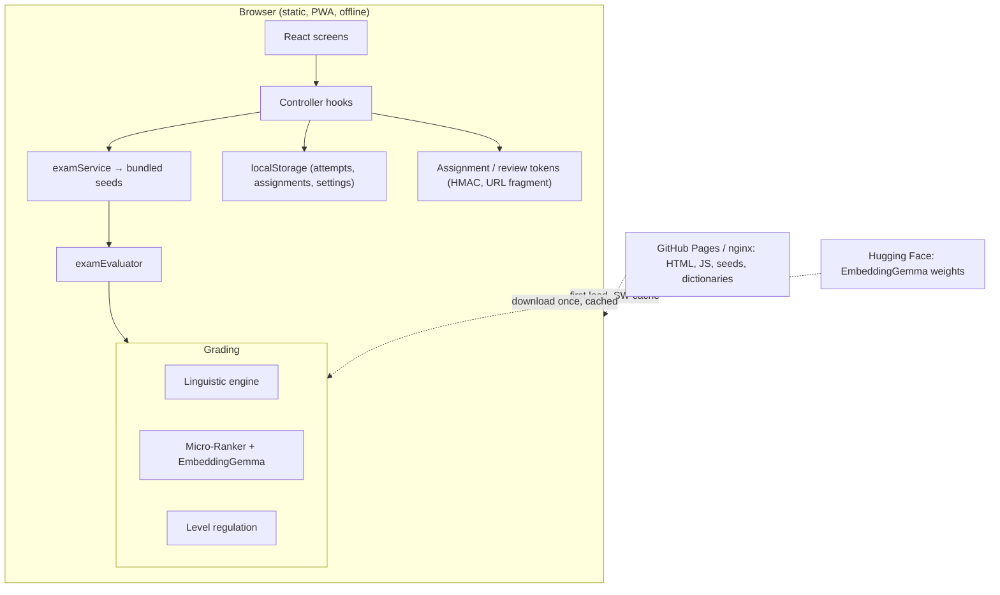

# Architecture — telc Deutsch A1 Exam Simulator

A static web app: exams, grading, history and AI inference run in the browser; the same `dist/` is served by GitHub Pages or nginx. This page is the map; details are in [`docs/architecture/`](docs/architecture/).

**Contents:** [Principles](#principles) · [System overview](#system-overview) · [Source layout](#source-layout) · [Documentation map](#documentation-map) · [Where to change what](#where-to-change-what)

---

## Principles

1. **Browser-first, serverless.** No backend, API or database. Exam data is bundled, answers are graded client-side, results live in `localStorage`. Adding a server needs the owner's explicit consent (CLAUDE.md §0).
2. **Offline-first, private.** After the first load (and the model download) the app works offline. Nothing about the student leaves the browser; teacher links travel in URL fragments.
3. **The regulation decides the score.** Grading follows `reglament/telc-a1.md`: detectors report facts, the level's regulation turns them into points. Not stricter and not more complex than the exam.
4. **Level-free engine.** The German analysis knows no CEFR level; level behaviour lives in policies, profiles, regulations and data injected through ports.
5. **Small modules behind contracts.** SRP, short functions, ports with interfaces and contract tests, verified at build time.

## System overview

```mermaid
flowchart TB
    subgraph Browser["Browser (static, PWA, offline)"]
        UI["React screens"] --> Hooks["Controller hooks"]
        Hooks --> ExamSvc["examService → bundled seeds"]
        Hooks --> Storage["localStorage (attempts, assignments, settings)"]
        Hooks --> Tokens["Assignment / review tokens (HMAC, URL fragment)"]
        ExamSvc --> Eval["examEvaluator"]
        Eval --> Grading["Schreiben grading (Web Worker)"]
        subgraph Grading
            Ling["Linguistic engine"]
            Ranker["Micro-Ranker + EmbeddingGemma"]
            Reg["Level regulation"]
        end
    end
    Host["GitHub Pages / nginx: HTML, JS, seeds, dictionaries"] -.->|first load, SW cache| Browser
    HF["Hugging Face: EmbeddingGemma weights"] -.->|download once, cached| Grading
```

## Source layout

| Path | Contents |
|---|---|
| `src/components/`, `src/hooks/`, `src/utils/`, `src/i18n/` | UI, controller hooks, helpers, translations |
| `src/data/exams/` | exam seeds and the `seedData.js` barrel |
| `src/services/examService.js`, `localDataService.js`, `evaluation/` | data port and answer grading |
| `src/services/schreiben/` | Schreiben grading: `grading/`, `linguistic/`, `feedback/`, `scoring/`, `profiles/`, `regulations/` |
| `src/services/ai/`, `src/services/embeddings/` | AI providers (Micro-Ranker, disabled generative ones), embedder |
| `src/services/storage/`, `security/`, `share/`, `assignment/` | local storage, teacher key and signing, token compression, assignment timer |
| `src/contracts/`, `scripts/contracts/`, `scripts/verify-contracts.js` | build-time contracts |
| `shared/testTypes.js` | module rules (time, tasks, points) |
| `scripts/seeds/`, `scripts/lexicon/` | seed validator, dictionary builders |
| `tests/` | unit tests, `ui/` (Playwright), `eval/`, `fixtures/` |
| `public/` | theme script, icons, fonts, manifest (the service worker is generated at build) |

## Documentation map

| Document | Read it for |
|---|---|
| [Frontend](docs/architecture/frontend.md) | screens, hooks, page grid and type scale, dialogs, theme, performance rules |
| [Data and storage](docs/architecture/data-and-storage.md) | seeds, `examService`, module rules, `localStorage` keys, PWA, deployment |
| [Schreiben grading](docs/architecture/schreiben-grading.md) | pipeline stages, Leitpunkt evidence, Micro-Ranker, arbitration, `IRankerPolicy`, `ISchreibenRegulation`, feedback |
| [Linguistic engine](docs/architecture/linguistic-engine.md) | lexicon port and dictionaries, grammar and letter rules, word order, level profile, precision |
| [Teacher assignments](docs/architecture/teacher-assignments.md) | `#task=` / `#review=` links, HMAC signing, lockout |
| [Quality gates](docs/architecture/quality-gates.md) | contracts, tests, UI suites, benchmarks, all commands |
| [ADDING_QUESTIONS.md](ADDING_QUESTIONS.md) | writing a new exam variant |
| [CREDITS.md](CREDITS.md) | libraries, models and data with licenses |

## Where to change what

| Task | Start here |
|---|---|
| New exam variant | [ADDING_QUESTIONS.md](ADDING_QUESTIONS.md) |
| Points or pass rules of Schreiben | `regulations/telcA1Regulation.js` + `reglament/telc-a1.md` |
| How coverage is classified (thresholds, compound points) | `grading/policies/a1RankerPolicy.js` |
| A grammar hint | `linguistic/grammarRules/` or `letterRules/`, enabled in `profiles/a1GrammarProfile.js` |
| New CEFR level | new regulation + ranker policy + grammar profile + reglament; no engine edits |
| Module time or points | `shared/testTypes.js` |
| A screen | its folder in `src/components/` and its controller hook |
