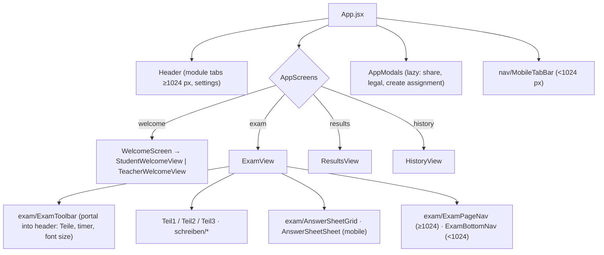

# Frontend

[← Architecture overview](../../ARCHITECTURE.md) · [Data and storage →](data-and-storage.md)

React 18 + Vite + Tailwind. Code: `src/components/`, `src/hooks/`, `src/utils/`, `src/i18n/`.

**Contents:** [Screens and hooks](#screens-and-hooks) · [Component tree](#component-tree) · [Layout system](#layout-system) · [Screens](#screens) · [Dialogs and sharing](#dialogs-and-sharing) · [Theme without flash](#theme-without-flash) · [i18n](#i18n) · [Performance rules](#performance-rules)

---

## Screens and hooks

**Screen orchestrator pattern**: top-level screens (`WelcomeScreen`, `ExamView`, `ResultsView`, `HistoryView`) hold little DOM and compose subcomponents from their folders (`welcome/`, `exam/`, `results/`, `history/`). State and logic live in controller hooks:

| Hook | Responsibility |
|---|---|
| `useAppController` | current view, modals (`useModalCoordinator`), theme |
| `useExamLoader` | loading exam variants through `examService` |
| `useExamSession`, `useExamTimer` | answers, wall-clock timer (sleeps outside an active exam, recalibrates on `visibilitychange`), completion |
| `useExamFlowActions` | submit, leave, finalize an assignment |
| `useAnswerSheet`, `useVisibleQuestion`, `useQuestionFlags` | Teil groups, question in view, flags |
| `useExamHotkeys` | R/F and A/B/C answer, ↑/↓ question, ←/→ Teil; off while typing or in a dialog |
| `useTextEntryFocus` | hides the bottom bar while a text field has focus |
| `useAssignmentMode`, `useReviewMode`, `useIssuedAssignments` | teacher links ([teacher assignments](teacher-assignments.md)) |
| `useWelcomeRole` | student/teacher role (`telc_welcome_role`), synced between instances by a window event |
| `useAttemptHistory` | local attempt history |
| `useSchreibenSelfCheck`, `useSchreibenAiChecker` | criterion levels and hints of one letter; async neural re-check |
| `useGradingPreload` | preloads the grading engine and lexicon when idle, so they are cached before going offline |
| `useModalDialog`, `useTheme`, `useExamFontSize`, `useCopyToClipboard` | UI utilities |

Home statistics: `utils/attemptStats.js` (best score per variant, always against the module `maxScore` from `shared/testTypes.js`), `utils/moduleProgress.js` (per-Teil average over the last 5 attempts, weakest Teil), `utils/moduleSplit.js` (assignments of the open module; the others show as chips via `welcome/OtherModulesHint`), `config/teilTitles.js`.

## Component tree

## Layout system

- **Breakpoints**: phone `<640`, tablet `640–1023`, desktop `≥1024` px.
- **Container**: `layout/pageLayout.js` — `PAGE_CONTAINER` (75rem), `SCREEN_COLUMN` (45rem on tablets), `PAGE_STACK`, `BAND`, `SPAN`.
- **Sizes in rem only** (no `-[Npx]`). Root font size is 16 px up to 1600 px, then `clamp(16px, 6px + 0.625vw, 32px)`, so large monitors show the same layout scaled.
- **Page grid**: desktop pages are bands of a 12-column grid (`layout/Band`, `data-band`; `align="stretch"` shares top/bottom edges, `"start"` for sticky columns). Below 1024 px a band dissolves (`display: contents`) and blocks reorder with `order-*`.
- **Blocks**: every block is a `layout/Section` — title above the frame, optional action in the title row, one frame (`card` / `desktop` / `none`), 24 px padding on desktop.
- **Type scale** (`layout/typography.js`): `PAGE_TITLE` (one h1 per screen), `PAGE_LEAD`, `SECTION_TITLE`, `CARD_TITLE`, `PART_TITLE`, `DIALOG_TITLE`, `NUMERIC` (tabular figures). Headings use only these tokens.
- **Navigation**: phones get `nav/MobileTabBar` (Home / History / Settings; settings is a lazy `<dialog>` sheet); from 1024 px the module switch is a header tab row. Exam header: ✕ · position · timer under 1024 px; from 1024 px the answer strip (Lesen) or Teil tabs (Schreiben) sit in the header and the page ends with its own Back/Next.

## Screens

- **Student home** (`welcome/StudentWelcomeView`): module briefing (`ModuleStructureCards variant="strip"`), bands exam | from the teacher (`welcome/student/TeacherTasksSection`) and progress by part | last 5 attempts, then the variants (`VariantGrid`).
- **Teacher home** (`welcome/TeacherWelcomeView`): same module heading with «Check a result link» and «New assignment», issued assignments of the open module, variants catalog. Teacher key in Settings (`nav/TeacherKeySection`).
- **Lesen exam**: Teil 1 text | questions and Teil 3 sign | statement split 7/5 (`SPAN.wide` / `SPAN.narrow`); Teil 2 shows both web pages side by side.
- **Results**: `ResultsHeroCard` (score, pass status, `ScoreThresholdBar`, per-Teil cells) + `ResultsActionBar` in one band; task review below. Lesen: `ResultsReviewList` (opens on mistakes after a failed attempt). Schreiben: `results/schreiben/SchreibenResultsBody` — Teil 1 table (`SchreibenFormReviewTable`), then the letter review (`SchreibenSelfCheck`); Form / Letter switch below 1024 px. Ranker internals and A/B cards only with `?debug` (`utils/debugFlag.js`).
- **History**: title with a local-storage note, four figures (`HistoryStatsGrid`), attempt list with clear/refresh.

## Dialogs and sharing

- `ui/Dialog` is a native `<dialog>` with `showModal()` (focus trap, Esc, inert page, focus return, `aria-labelledby`): bottom sheet below 640 px, centred window above.
- `share/ShareLinkPanel`: one truncated link + Copy; `navigator.share` first on phones; Telegram/WhatsApp and QR code from 640 px (`share/QrCodeImage` imports `qrcode` on demand).

## Theme without flash

- `<meta name="color-scheme" content="dark light">` in `<head>`.
- `public/theme-init.js` — a synchronous, CSP-compatible script that reads `localStorage` / `prefers-color-scheme` and sets `.dark`/`.light` and `colorScheme` before the first paint.

## i18n

UI in German, English, Russian (`src/i18n/locales/`). `t()` returns the key for a missing entry, so `tests/i18n-used-keys.test.js` checks every literal `t('a.b')` key against `TRANSLATION_CONTRACT`; the Playwright suite fails on raw keys on screen.

## Performance rules

Summary of CLAUDE.md §11 as applied here:
- no idle timers or polling; window listeners guarded and cleaned up;
- screens and heavy modals via `React.lazy()`; vendor chunks `vendor-react`, `vendor-icons`, `vendor-ai-runtime`; exam data is the lazy `exam-seeds` chunk;
- entry chunk budget 300 kB enforced by `mainChunkBudgetPlugin` (`vite.config.js`); the grading engine and lexicon are imported dynamically;
- Brotli/Gzip pre-compression (`vite-plugin-compression2`); relative asset and font paths for GitHub Pages subpaths.
