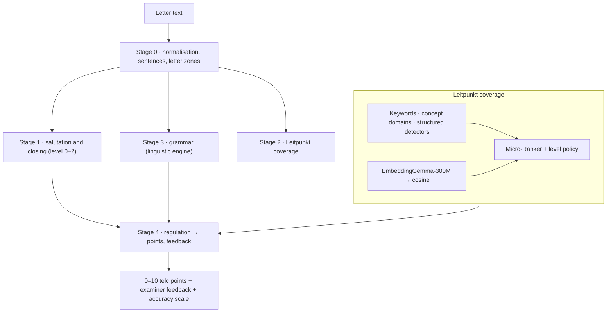

# Schreiben grading

[← Architecture overview](../../ARCHITECTURE.md) · [Linguistic engine →](linguistic-engine.md)

How a Schreiben Teil 2 letter becomes official telc points and feedback. Everything runs in the browser. Code: `src/services/schreiben/`.

**Contents:** [Pipeline](#pipeline) · [Level context](#level-context-and-ports) · [Leitpunkt coverage](#leitpunkt-coverage) · [Micro-Ranker](#micro-ranker) · [Arbitration](#arbitration) · [Ranker policy](#ranker-policy-irankerpolicy) · [Regulation](#exam-regulation-ischreibenregulation) · [Feedback](#feedback) · [Linguistic accuracy scale](#linguistic-accuracy-scale) · [Runtime modes](#runtime-modes) · [Known limits](#known-limits)

---

## Pipeline

| Stage | Modules | Output |
|---|---|---|
| 0 | `grading/stage0Preprocessing.js`, `schreibenTextSegmenter.js`, `linguistic/macroSegmenter.js` | sentences, letter zones (salutation / body / closing); `schreibenTextSegmenter` assigns body sentences to Leitpunkte |
| 1 | `grading/stage1SalutationClosing.js`, `salutationAnalyzer.js`, `closingAnalyzer.js` | Anrede and Gruß levels |
| 2 | `grading/stage2Leitpunkte.js`, `grading/pipelineStageScorers.js`, `grading/leitpunktArbitration.js` | level 0/1/2 per Leitpunkt with evidence sentences |
| 3 | `grading/pipelineStageScorers.collectPipelineGrammarErrors` → [linguistic engine](linguistic-engine.md) | grammar errors (feedback only) |
| 4 | `regulations/`, `grading/pipelineFeedback.js` | points, examiner feedback descriptor (rendered in the UI language) |

**Entry point:** `gradingPipeline.gradeSchreibenSubmission`, the only grading path. The letter is graded at submission: `localDataService.submitLocalExamAnswers` gives the exam evaluator (`evaluation/examEvaluator.evaluateExamSubmission`) the `gradeEssay` port `grading/essayGrader.gradeEssayWithActiveProvider`, which asks the registry for the provider — the Micro-Ranker whenever it is available — and grades in the Web Worker (`grading/gradingWorkerClient.gradeSchreibenWithWorker`). The provider is chosen on the main thread, where the `telc_ai_provider_override` in localStorage is readable, and reaches the worker only as the fact `forceLimitedMode`; inside the worker the Micro-Ranker counts as available (`WorkerGlobalScope`). The worker is terminated after every grading; its timeout counts idle time between progress messages, so the first model download is not cut off. Without `Worker` the pipeline runs directly; if the worker fails, grading falls back to the limited mode. The saved attempt keeps the full result with `provider_id`, so history, the exam total and the results screen show one grade; the results screen (`useSchreibenAiChecker`) grades again only attempts saved without a provider (`needsPipelineGrading`). The result also states how the letter was actually graded, `grading_mode` (`GRADING_MODES` in `ai/types.js`): `ranker` when the embedding model embedded every body sentence (the Stage 2 fact `modelUsed`), `ranker_without_model` when the Micro-Ranker was chosen but the model gave no vectors (offline before the download, a WebGPU/WASM failure) and its verdicts are the deterministic fallback, `limited` in the limited mode. `is_limited_mode` is true unless the mode is `ranker`; the results screen names the mode (`SchreibenAiControlBar`), attempts saved before it was recorded show no label. Grading progress is the DTO `{ stage, fraction, loadedBytes? }` (`GRADING_STAGES` in `ai/types.js`), posted by the worker as is and passed by `submitLocalExamAnswers({ onProgress })` to the exam session (`gradingProgress`). Stage 2 loads the embedding model first (`embeddingService.loadEmbeddingModel`); on the first grading the download is reported as `model_download` with the loaded bytes (`embeddings/modelDownloadProgress`: the sum over the model files, once per megabyte), and the submit and time-up dialogs show it (`GradingProgressNote`).

Every entry point first awaits the lexicon data (`levelContext.lexicon.load()`), because the noun and verb dictionaries are a lazily loaded asset.

## Level context and ports

- A task declares its CEFR `level` in the seed (`level: 'A1'`). `taskLevel.resolveTaskLevel` maps it; a task without a level is legacy data (stored attempts, old links) and counts as A1; an unregistered level throws `RangeError` (fail fast, no silent A1 fallback).
- `levelContext.resolveLevelContext(level)` → `{ level, policy, lexicon, grammar }` is the one place that binds a level to its ranker policy, lexicon port and grammar checker. Entry points resolve it and pass it down; engine functions have no level default (`grading/levelPorts.requireLevelPort` fails fast).
- Level-free engine is enforced by `scripts/contracts/levelFreeEngineContract.js`: no level reference outside `grading/policies/`, `profiles/`, `regulations/`, `linguistic/a1LexiconService.js`.
- Accepted deviations (review 2026-09-28): the A1 lexicon (`a1Lexicon.json`, `a1LexiconService.js`) lies in `linguistic/` but only the profile and the policy import it; a meaning distortion caps a Leitpunkt's coverage level in `pipelineStageScorers.js`, which is still a fact (level 0/1/2) that the regulation prices; small parser word sets (connectors, prepositions, role markers) stay next to the detector that parses them.

## Leitpunkt coverage

**Rubric data, not label guessing.** Each Leitpunkt in the seed rubric (`options_json.rubric.leitpunkte_criteria`) declares:
- `keywords`, `requiredMatches` — task vocabulary;
- `intent` — speech act: `DEFECT_REPORT`, `ACTION_REQUEST`, `APPOINTMENT_CANCEL`, `APPOINTMENT_PROPOSAL`, `INFORMATION_REQUEST`, `REASON_EXPLANATION`, `GENERAL` (`linguistic/criterionIntents.js`);
- optional `evidence: 'temporal' | 'personCount' | 'occupation'` on the criterion or an aspect;
- optional `aspects: [{ label, keywords?, evidence? }]` for compound points ("Preis und Haustiere").

`scripts/contracts/rubricContract.js` rejects rubrics without a valid intent/evidence or a registered level.

**Evidence kinds** (split by trust):

| Kind | Source | Proves |
|---|---|---|
| Lexical | rubric keywords (`linguistic/keywordStemMatcher.js`, `keywordConcepts.js`), concept domains (`grading/conceptDomainScorer.js` + level `conceptDomains`), label noun overlap | the topic is touched |
| Structured | `grading/temporalRangeDetector.js` (date range, duration, calendar point), `personCountDetector.js` (numeral + person noun), `occupationDetector.js` | the aspect is stated |
| Neural | cosine(EmbeddingGemma query, sentence) | semantic closeness |

Key rules:
- **Keyword matching** goes through the lexicon lemma and Snowball stem (`linguistic/lemmaStem.js`); a noun never matches a verb of the same stem ("wohne" ≠ "Wohnung"); multi-word keywords match in a row; separable verbs match their split form ("Wie melde ich mich an?" → "anmelden"). Spellings of one lemma are one concept, so `requiredMatches` is capped by the number of distinct concepts.
- **Concept domains** match a whole word or the head of a compound (`Kurskosten` → Kosten), never a substring ("Steuer" is not "teuer").
- **Compound criteria** (`grading/compoundCriterionDecomposer.js`, `compoundBaselineEvaluator.js`): each aspect is scored separately; the point is full only when every aspect is full, partial when at least one is. Aspects read only affirmed clauses (`extractAffirmativeText`).
- **Declared evidence gate**: a criterion that declares `evidence` is supported only if its detector or its own keywords find it; similarity alone does not state "how long".
- **Rival attribution** (`grading/rivalEvidence.js`): evidence skips a sentence that fully states another Leitpunkt and not this one.
- **One sentence may serve several Leitpunkte** — deliberately, as an examiner would credit it.
- **Refusals and inversions** (`linguistic/criterionRefusalDetector.js`, `grading/criterionPolarityGate.js`): a negation refuses a point only when it targets the criterion's own keywords — `negated_entity` ("kein Zimmer"), `negated_action`, `negated_participant` ("Meine Schwester kommt nicht"), `negated_object` after a DESIRE verb ("Einen neuen Termin möchte ich nicht"). Complements under `nicht` only contrast ("nicht am Montag"). Which negations *express* the intent instead (a cancellation, "funktioniert nicht") is declared in `INTENT_POLARITY` (`semanticIntentMatcher.js`). A refusal zeroes the point only when no affirmative evidence exists.
- **Content facts** (`grading/letterContentFacts.js`): `{ hasPredication, hasTaskAnchor }`. A noun list states nothing; a letter that names no rubric keyword is off topic. The regulation decides what these facts cost.
- **Unassigned sentences** (`grading/unassignedSentences.js`) are listed for debugging only, never scored.

## Micro-Ranker

`MicroRankerProvider.js` + `grading/microRankerService.js`, the primary decision model (`aiConfig.PRIMARY_PROVIDER = 'micro_ranker'`).

- Query = criterion label + rubric keywords (`rankerFallbackScorer.formatCriterionQuery`). The ranker owns no model: it gets an **embedder port** (`embeddings/rankerEmbedder.js`, `{ embedQuery, embedText }`) backed by the same EmbeddingGemma instance as Stage 2, pre-seeded with Stage 2 vectors.
- EmbeddingGemma prefixes: `task: sentence similarity | query:` / `| text:`; Matryoshka 256-d cosine.
- **Competitive gate**: absolute cosine is not comparable across criteria, so a sentence earns neural credit only for the Leitpunkt it is closest to (`rivalCriteria`).
- **Clause candidates**: sentences are also judged clause by clause (`clauseStructureParser.parseSentencePropositions`), so "Was kostet der Kurs und wie melde ich mich an?" is not diluted.
- **Ranker veto**: when the embedder rejected a sentence, a lexical-only hit is capped below full (`isLexicalVeto`); structured evidence still stands.
- Why EmbeddingGemma: a multilingual cross-encoder (mmarco-mMiniLMv2) gave near-zero scores on rubric-style queries and needs a ~470 MB fp32 ONNX; the earlier English MiniLM cross-encoder always returned 1.0 in the used pipeline.

## Arbitration

`grading/leitpunktArbitration.js` merges the deterministic baseline with the provider verdict (`mergeArbitrationVerdict`):
- The primary Micro-Ranker judges **every** Leitpunkt and may lower the keyword baseline (a `no` → 0, a vetoed aspect → partial) — only when the policy trusts it on those sentences (`isVerdictReliable`; A1: ≤ 30 % words outside the lexicon, since typo-heavy letters look like noise to the embedder).
- A compound point with a missing aspect is capped at partial.
- A similarity-only point (no keyword/concept/structured evidence) is not floored by that baseline.
- An untrusted verdict may raise but not lower a verified baseline (confidence floor, `isProtected`).
- Only the Micro-Ranker arbitrates; the limited mode (`none`) keeps the baseline. There are no generative providers.
- Frame penalties and semantic inversions skip arbitration.
- Telemetry: `rankerScore`, `isProtected`, `diff_summary` (shown only with `?debug`).

## Ranker policy (`IRankerPolicy`)

`grading/policies/rankerPolicyInterface.js`; registry `grading/policies/index.js` (`getRankerPolicy(level)`); A1: `a1RankerPolicy.js`, `a1ConceptDomains.js`.

Decides **how coverage is classified** and emits levels 0/1/2:
- `thresholds` (A1: full 0.65, partial 0.40), `calibrateNeuralScore` (A1 maps raw cosine cut-offs 0.70 / 0.55 onto that scale), `classifyScore`, `combineEvidence`, `aggregateCompound`;
- `isLexicalVeto`, `isVerdictReliable`, `capUnprovenLexical` (A1: "wir" answers "how many persons" only partly);
- `conceptDomains`, `lexicon`, `feedbackSelection`, `buildExaminerFeedback(facts)`.

Task entities (cities, items) live only in rubric keywords; concept domains hold general level vocabulary.

## Exam regulation (`ISchreibenRegulation`)

`regulations/schreibenRegulationInterface.js`; registry `regulations/index.js` (`getSchreibenRegulation`, `registerSchreibenRegulation`, `scoreCriteriaLevels`); A1: `regulations/telcA1Regulation.js` per `reglament/telc-a1.md` (Teil 1 — Formular, §6).

Decides **what the facts are worth**. Contract: `id`, `level`, `maxPoints`, `trainingPassMark`, `acceptsTeil1Answer(facts)`, `scoreTeil2(evidence)`; evidence = `{ leitpunktLevels, anrede, gruss, grammarErrors, wordCount, isUnratable, content }`.

Teil 1 (form fields): `schreibenTeil1Evaluator.js` compares the answer, and each run of its words, with every accepted answer (`schreibenFormAnswerFacts.js` → `FormAnswerFacts` = `{ sameText, sameNumberOrDate, numberAnswer, rivalWords, singleWord, shorterLength, editDistance, sameSound }`) and asks the regulation of `question.level`. `numberAnswer` (a digit or a number word other than the article "eine", in the answer or its whole expected answer) and `rivalWords` (two different months or weekdays, from `linguistic/data/calendarWords.json` and `clauseWordClasses.json`) rule out any typo or sound tolerance: a number counts only "eindeutig richtig", and "Juni" for "Juli" is another answer, not a misspelling. Numbers compare all of their numbers and the words beside them, so "zwei Kinder" ≠ "2 Kinder und 1 Erwachsener". `sameSound` compares German sound keys (`linguistic/germanSoundKey.js`, rules in `linguistic/data/germanSpellingSounds.json`): spelling-to-sound rules that keep the vowels and the marked vowel length, so "donastag" = Donnerstag but Dienstag ≠ Donnerstag and Miete ≠ Mitte. Kölner Phonetik (`cologne-phonetic`, `talisman`) was rejected: it drops the vowels and gives Dienstag and "donastag" one code; Phonem does not vocalise r; `double-metaphone` is English.

telc A1 Teil 1: the same text, an umlaut transliteration or the same number/date counts; numbers only exactly, with the same words beside them ("ein Jahr" = "1 Jahr", "ein Monat" ≠ "1 Jahr"), and the words of a number or date answer too ("18. Juni" ≠ "18. Juli"); one typo from 4 letters, two from 8, or the same sound key — for a single word only: a phrase is compared word by word, so "am Sonntag" ≠ "am Montag".

telc A1 Teil 2:
- each Leitpunkt 3 / 1.5 / 0; Kommunikative Gestaltung (Anrede + Gruß) 1 / 0.5 / 0; max 10;
- no predication or no task anchor → every Leitpunkt 0 (`leitpunkteVoidReason`: `NO_PREDICATION`, `OFF_TOPIC`); gibberish/empty → 0;
- grammar, spelling and length are **not** criteria; a declension slip in a correct formula ("Sehr geehrte Herr") keeps the point and becomes a hint.

Result shape: `breakdown.items[i].points/maxPoints` (detector level kept in `detectedScore`), `breakdown.leitpunkte`, `breakdown.kommunikative_gestaltung`, `breakdown.leitpunkte_void_reason`, `criteria_breakdown` (levels + `kg` + `scale`). Saved attempts store levels and are re-scored on the current scale when opened (the self-check UI uses the same `scoreCriteriaLevels`).

**Adding a level:** `reglament/<level>.md` → regulation + ranker policy + grammar profile → register → regression suite. A1 code stays untouched.

## Feedback

- **Diagnostic codes** (`feedback/feedbackContracts.js`): `LP_FULFILLED`, `LP_PARTIAL`, `LP_MISSING`, `LP_INVERTED_REQUEST`, `LP_INVERTED_GENERAL`, `LP_FRAME_VIOLATION`, `ANREDE_*`, `GRUSS_*`, …
- **Examiner feedback**: `IRankerPolicy.buildExaminerFeedback(facts)` → language-neutral `examiner_feedback = { version, summary: [{code, params}], bullets: [...] }` (`feedback/examinerFeedbackBuilder.js`). Params hold only verbatim quotes of the letter and rubric labels. Grammar highlights are picked by error `code`/`category` (`grammarHighlightSelector.js`). Rendered **at display time** in the UI language (`examinerFeedbackRenderer.js`, `examinerPhraseBank.js`), so stored attempts re-render after a language switch. The summary names a void reason and never quotes against a 0.
- **Tutor notes** (`feedback/tutorFeedbackResolver.js`): one sentence per criterion in ru/en/de.
- UI: `results/schreiben/*` — `SchreibenSelfCheck` (conclusion → criteria → texts with credited phrases highlighted via `utils/letterHighlights.js` → details), `SchreibenExaminerFeedbackCard`, `SchreibenRankerDetailsCard` only with `?debug`.

## Linguistic accuracy scale

A pedagogical 0–10 score **independent of the telc score** (`scoring/linguisticAccuracyScorer.js`, UI `LinguisticAccuracyPanel.jsx`, labelled as not affecting the result):
- defects deduplicated across analyzers (`linguistic/grammarErrorDeduper.js`, in `mergeCandidateGrammarErrors`);
- weighted by category from the grammar profile's `accuracyWeights` (A1: syntax 1.5, case/agreement 1.0, spelling 0.5);
- normalised per 30 words of the letter body (`scoring/letterBodyWordCounter.js`); not rated when no Leitpunkt is covered.

## Runtime modes

Capability is detected at run time, never by user agent: the embedder picks WebGPU only when `navigator.gpu.requestAdapter()` grants an adapter (`utils/webGpuSupport.isWebGPUAdapterAvailable`, on the main thread and in the worker), otherwise WASM.

| Environment | Embeddings | Mode |
|---|---|---|
| WebGPU available | Transformers.js WebGPU, EmbeddingGemma 300M q4 | Micro-Ranker |
| No WebGPU | Transformers.js Wasm | Micro-Ranker (Wasm) |
| Model unavailable | — | limited deterministic mode (keywords, detectors, rules) |

The primary provider is set in `src/config/aiConfig.js` (`PRIMARY_PROVIDER`); a developer override via `localStorage` (`telc_ai_provider_override`, e.g. `none`) forces a registered provider.

## Known limits

Recorded instead of fitting (CLAUDE.md §8.1):
- typo-heavy letters keep partial scores: fuzzy/phonetic keyword matching read correct words as keywords (kurz→Kurs, Mund→Hund) and was rejected for Teil 2; the sound key serves only Teil 1, where one answer is compared with one expected word;
- Teil 1: "Donerstach" for Donnerstag (an example of the official rating) is not accepted: "final ch = g" would also join Flug/Fluch and Teig/Teich;
- Teil 1: the one-typo tolerance also accepts another real word at distance 1 ("Mitte" for Miete, "Sontag" for Montag);
- engine calibration constants (`SIMILARITY_T1/T2` in `grading/types.js`, keyword similarities in `pipelineStageScorers.js`) are model calibration, not level rules; they stay until the trained calibration in the ranker policy replaces them;
- "Ich frage nicht nach Kosten" is not a refusal until prepositional verb valency is data for all A1 verbs;
- verb forms outside the lexicon are not folded to one concept ("meldet" ≠ "melden");
- a month alone ("im August") counts as a Zeitraum until a regulation source says otherwise.

Grammar limits: see [linguistic engine](linguistic-engine.md#known-limits).
