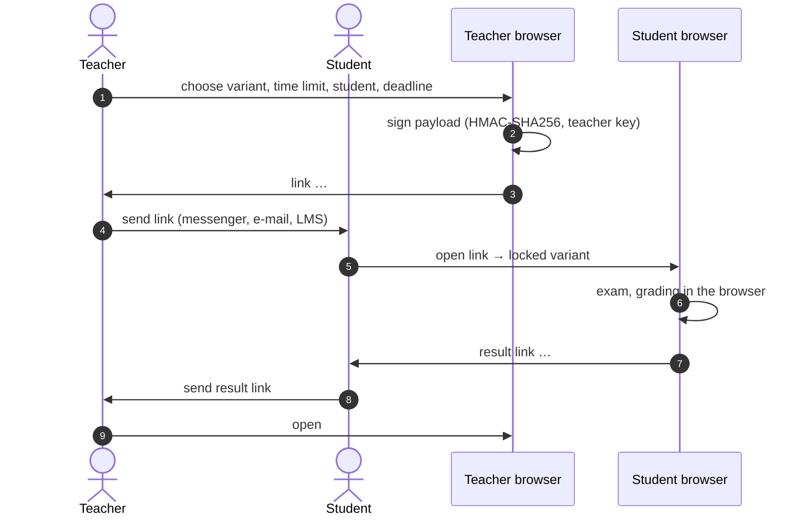

# Teacher assignments

[← Architecture overview](../../ARCHITECTURE.md) · [Data and storage →](data-and-storage.md)

Teachers give tasks and check results without a server: everything travels in URL fragments, which browsers never send to the host.

**Contents:** [Flow](#flow) · [Links](#links) · [Signing](#signing) · [Student side](#student-side) · [Teacher side](#teacher-side)

---

## Flow

## Links

| Fragment | Service | Content |
|---|---|---|
| `#task=` | `services/assignmentTokenService.js` (`createAssignmentLink` → `{ assignmentId, url }`, `parseAssignmentTokenFromUrl`) | assignment id, exam id, time limit, student name, signature; optional `due` deadline (not signed — a reminder, not an exam condition) |
| `#review=` | `services/shareTokenService.js` (`buildShareUrl`, `decodeAttemptToken`) | the attempt with answers and score, the teacher signature of the task |

Tokens are compressed with native `CompressionStream('deflate-raw')` + Base64URL (`services/share/streamCompressor.js`). Going home (`navigateHome`, `leaveExam`) tears down the mode and removes `#task=` / `#review=` from the address bar (`history.replaceState`), so a reload lands on the home screen.

## Signing

`services/security/teacherSecurityService.js`: the teacher key is generated in the browser and stored in `localStorage['telc_teacher_key']` (editable in Settings → `nav/TeacherKeySection`). `signAssignmentPayload` signs the canonical message (`buildCanonicalAssignmentMessage`: assignment id, exam id, created, limit, student) with HMAC-SHA256 via Web Crypto. When the teacher opens a `#review=` link, `useReviewMode` checks the signature with the same key (`verifyAssignmentSignature`), so an edited task or a result for another task is detected. Web Crypto needs a secure context (HTTPS or localhost).

## Student side

- `useAssignmentMode` parses `#task=`, opens the locked variant and records it in `localStorage['telc_assignments']` (`storage/receivedAssignmentsStorage.js`) with the score after submission; the home screen lists received tasks after the hash is gone.
- Remaining time survives reloads: `services/assignment/assignmentTimerService.calculateAssignmentTimerState` works from the recorded start time.
- One submission per task: `storage/assignmentLockoutStorage.js` (`telc_assignment_lockout_<id>`) records start and submission; a retake is blocked.
- On submit `useExamFlowActions` calls `finalizeAssignment`, which builds the `#review=` link; `ResultsView` shows `AssignmentSubmissionBanner` with a copy button.
- Inspection mode (`exam/InspectionInfoCard`) lets a teacher preview a variant without adding attempts to history.

## Teacher side

- `useIssuedAssignments` + `storage/issuedAssignmentsStorage.js` (`localStorage['telc_issued']`): link, variant, student, deadline, `submissions[]`.
- Opening a `#review=` link of an issued task records the submission (student, score, token), so the list shows status, score, or «N submitted · avg» for group links.
- The teacher home shows issued tasks of the open module; other modules appear as chips.
